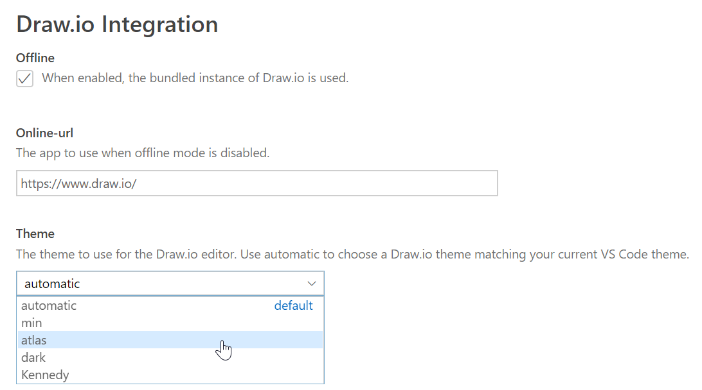

# Draw.io VS Code Integration


[](https://github.com/sponsors/hediet)
[](https://www.paypal.com/cgi-bin/webscr?cmd=_s-xclick&hosted_button_id=ZP5F38L4C88UY&source=url)
[](https://twitter.com/intent/follow?screen_name=hediet_dev)

This unofficial extension integrates [Draw.io](https://app.diagrams.net/) into VS Code.

## Features

-   Edit `.drawio`, `.dio` or `.drawio.svg` files in the Draw.io editor.
-   To create a new diagram, simply create an empty `*.drawio` or `*.drawio.svg` file and open it!
-   `.drawio.svg` are valid `.svg` files that can be embedded in Github readme files! No export needed.
-   To convert a Draw.io file from `.drawio` to `.drawio.svg`, use the `File: Save As` command.
-   Uses an offline version of Draw.io by default.

## Demo


## Editing .drawio.png Files (Not Released Yet)

_This feature is not released yet as it uses unstable VS Code APIs. This feature might be stable in the next release of VS Code ._

You can directly edit and save `.drawio.png` files.
These files are perfectly valid png-images that contain an embedded Draw.io diagram.
Whenever you edit such a file, the png part of that file is kept up to date.

The logo of this extension is such a `.drawio.png` file that has been created with the extension itself!


## Settings

This extension contributes the following settings:



<details>
    <summary><b>Available Draw.io Themes</b></summary>
    <!-- Please use HTML syntax here so that it works for Github and mkdocs -->
    <ul>
        <li><p>Theme "atlas"</p></li>
        <li><p>Theme "Kennedy"</p></li>
        <li><p>Theme "min"</p>
        <li><p>Theme "dark"</p></li>
    </ul>
</details>

## Associate `.svg` Files With This Editor

By default, this extension only handles `*.drawio.svg` files.
Add this to your VS Code `settings.json` file, if you want to associate it with `.svg` files:

```json
"workbench.editorAssociations": [
    {
        "viewType": "hediet.vscode-drawio-text",
        "filenamePattern": "*.svg"
    }
]
```

You won't be able to edit arbitrary SVG files though - only those that have been created with Draw.io or this extension!

## Editing the Diagram and its XML Side by Side

You can open the same `*.drawio` file with the Draw.io editor and as xml file.
They are synchronized, so you can switch between them as you like it.
This is super pratical if you want to use find/replace to rename text or other features of VS Code to speed up your diagram creation/edit process.
Use the `File: Reopen With...` command to toggle between the text or the Draw.io editor. You can open multiple editors for the same file.


## Contributors

-   Henning Dieterichs, [hediet](https://github.com/hediet) on Github (Main Contributor / Author)
-   Vincent Rouillé, [Speedy37](https://github.com/Speedy37) on Github

## See Also / Similar Extensions

-   [Draw.io](https://app.diagrams.net/) - This extension relies on the giant work of Draw.io. Their embedding feature enables this extension! This extension bundles a recent version of Draw.io.
-   [vscode-drawio](https://github.com/eightHundreds/vscode-drawio) by eightHundreds.

## Other Cool Extensions

If you like this extension, you might like [my other extensions](https://marketplace.visualstudio.com/search?term=henning%20dieterichs&target=VSCode) too:

-   **[Debug Visualizer](https://marketplace.visualstudio.com/items?itemName=hediet.debug-visualizer)**: An extension for visualizing data structures while debugging.
-   **[Tasks Statusbar](https://marketplace.visualstudio.com/items?itemName=hediet.tasks-statusbar)**: This extension adds buttons to the status bar to quickly start and kill tasks.
