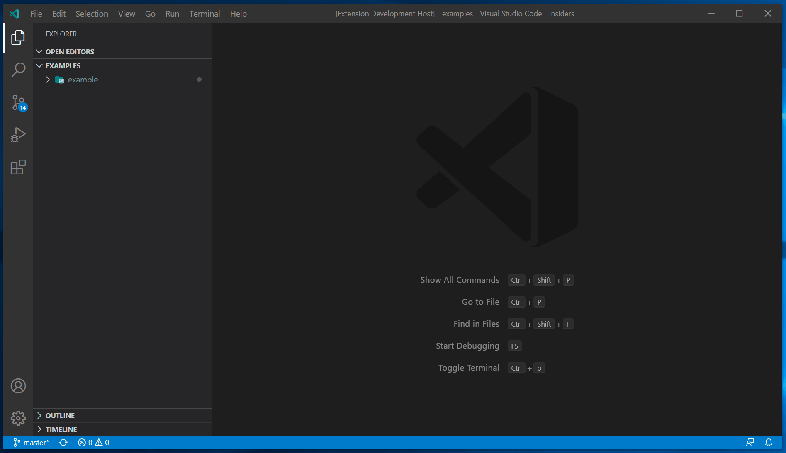
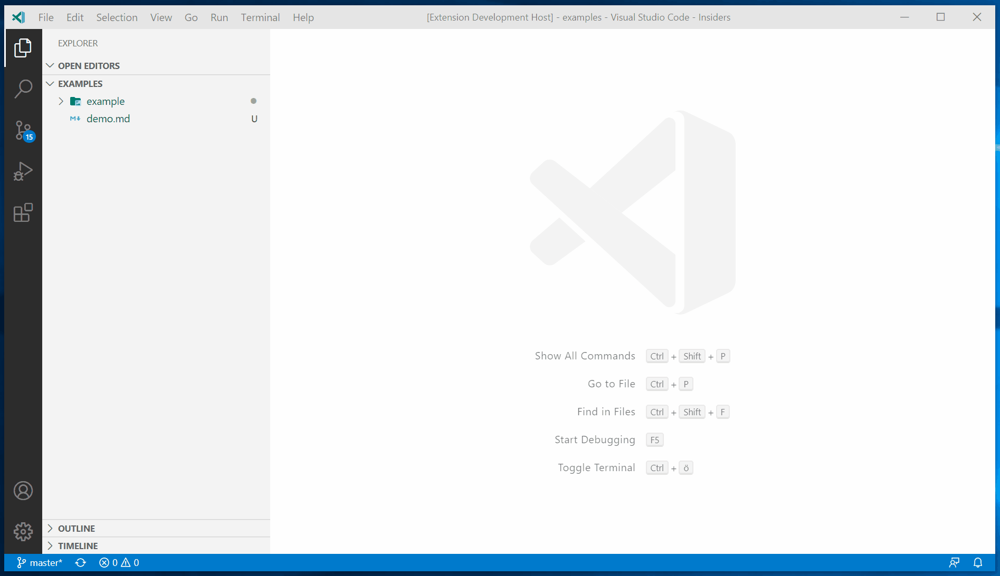
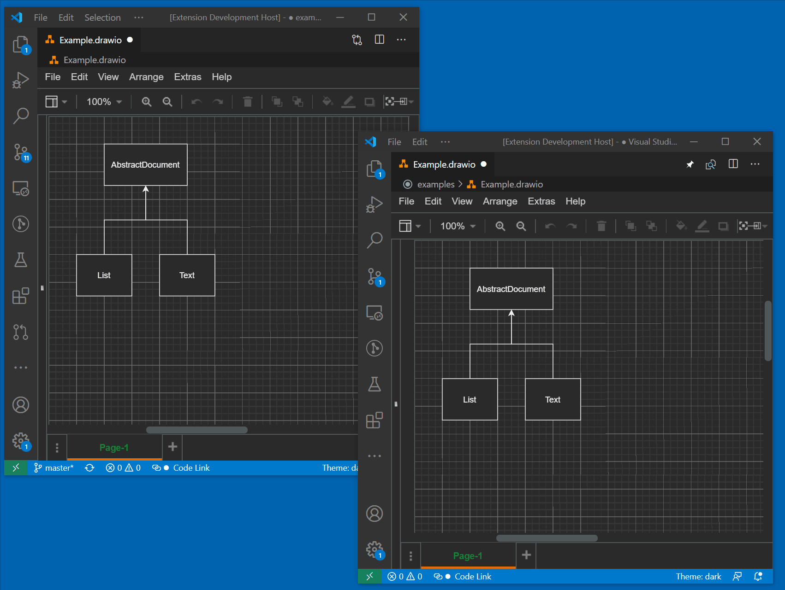
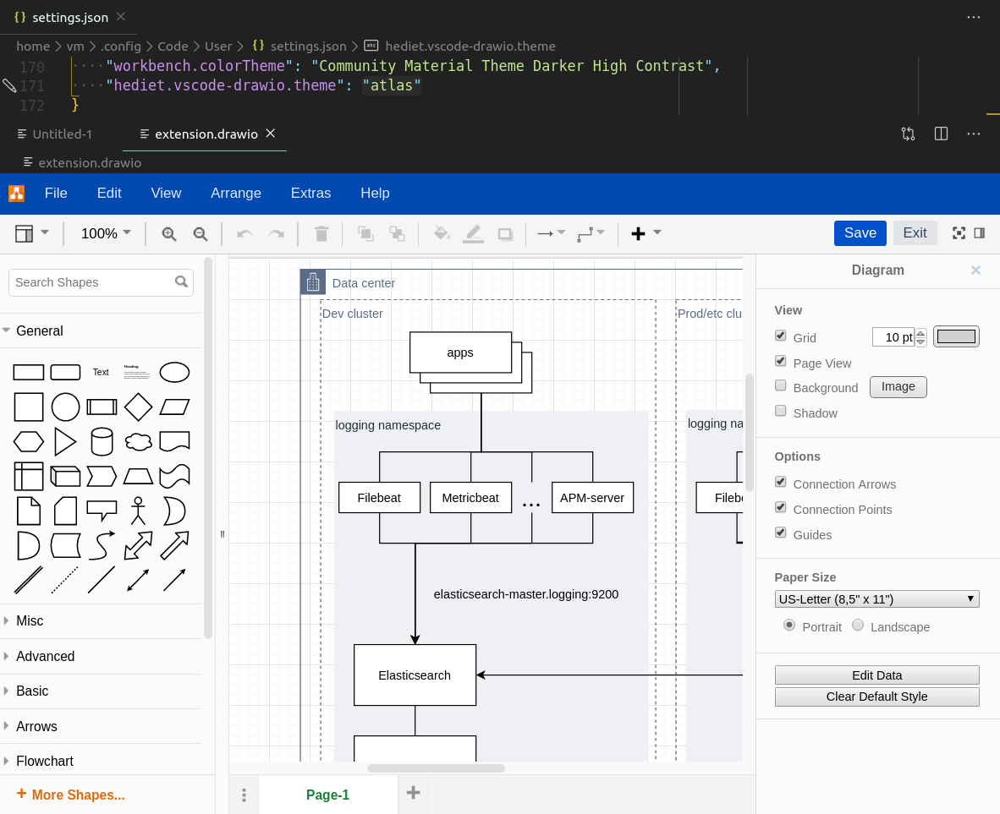
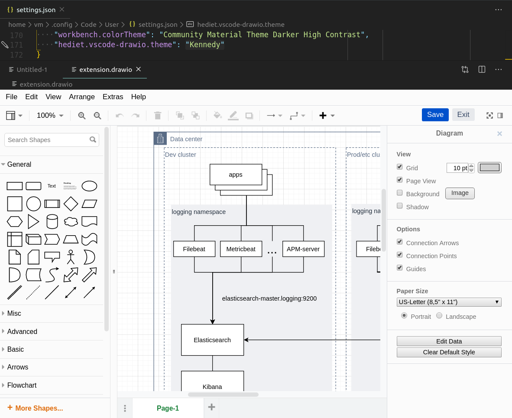
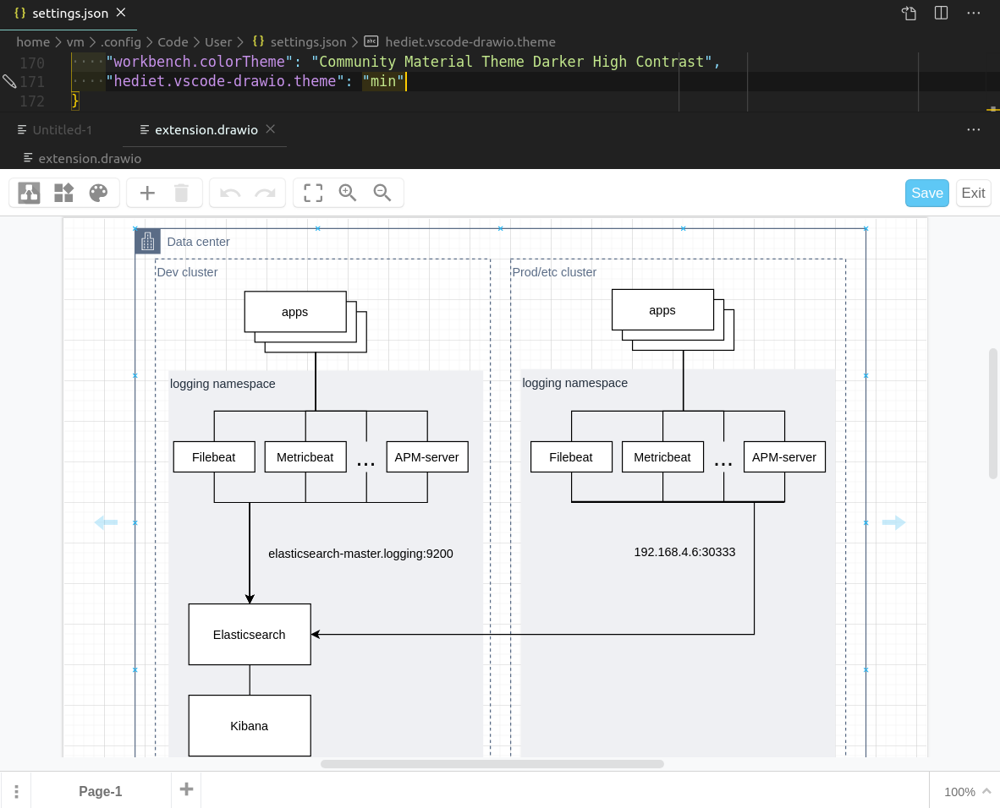
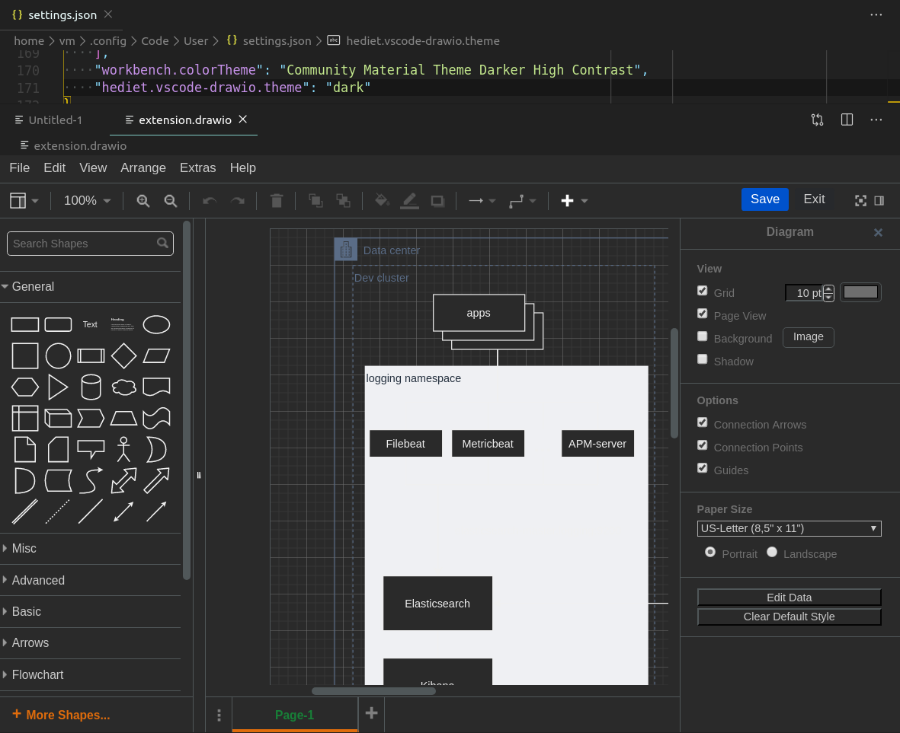
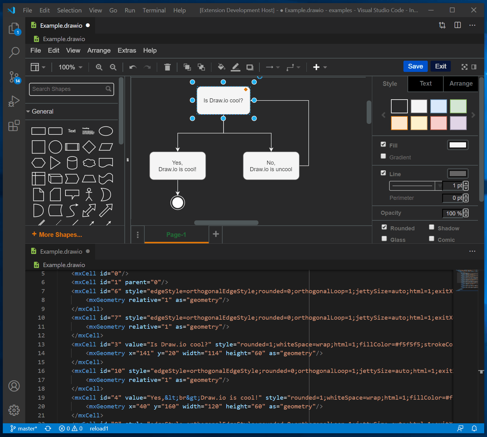

# Draw.io VS Code Integration

[](https://github.com/sponsors/hediet)
[](https://www.paypal.com/cgi-bin/webscr?cmd=_s-xclick&hosted_button_id=ZP5F38L4C88UY&source=url)
[](https://twitter.com/intent/follow?screen_name=hediet_dev)

This unofficial extension integrates [Draw.io](https://app.diagrams.net/) (also known as [diagrams.net](diagrams.net)) into VS Code.

## Features

-   Edit `.drawio`, `.dio`, `.drawio.svg` or `.drawio.png` files in the Draw.io editor.
    -   To create a new diagram, simply create an empty `*.drawio`, `*.drawio.svg` or `*.drawio.png` file and open it.
    -   `.drawio.svg` are valid `.svg` files that can be embedded in Github readme files! No export needed.
    -   `.drawio.png` are valid `.png` files! No export needed. You should use `.svg` though whenever possible - they look much better!
    -   To convert between different formats, use the `Draw.io: Convert To...` command.
-   Uses an offline version of Draw.io by default.
-   Multiple Draw.io themes are available.
-   Use liveshare to collaboratively edit a diagram with others.
-   Nodes/edges can be linked with code spans.

## Demo



<br />
<br />

# Like it so far? You might also like my [open source](https://github.com/hediet/chrome-ext-github-monaco) [Chrome extension that enhances the Github markdown editor](https://chrome.google.com/webstore/detail/monaco-markdown-editor-fo/mmpbdjdnmhgkpligeniippcgfmkgkpnf)!

<br />
<br />

## Editing .drawio.svg/.drawio.png Files

You can directly edit and save `.drawio.svg` and `.drawio.png` files.
These files are perfectly valid svg/png-images that contain an embedded Draw.io diagram.
Whenever you edit such a file, the svg/png part of that file is kept up to date.

The logo of this extension is such a `.drawio.png` file that has been created with the extension itself!



If diffs are important for you, you should prefer `.drawio` and avoid `.drawio.png` diagrams.

## Collaboratively Edit Or Present Diagrams

With version 1.0 of this extension, extensive support for [VS Code Liveshare](https://visualstudio.microsoft.com/de/services/live-share/) has been added. You can now edit or present your Draw.io diagrams remotely, while seeing each participant's cursor and selection! This can be used for discussing, reviewing or brainstorming diagrams.
With Draw.io's freehand drawing tool and integrated LaTeX support, this extension becomes an advanced whiteboard solution that can be used for remote code interviews!



_Internally, this extension synchronizes Draw.io diagrams with text documents.
These text documents are shared by Liveshare. As Liveshare has no understanding of the text, modification conflicts might occur on simultaneous modifications._

## Code Link Feature

In the status bar, you can enable or disable the code link feature.
If it is enabled and you double click on a node whose label starts with `#`,
you will perform a workspace search for a symbol matching the rest of the label.

If you have a node labeled `#MyClass` and a class of name `MyClass`, you will jump to its source if you double click the node!

**Please note that you have to open at least one file of the project that contains the symbol.**
Otherwise, VS Code will not consider this project when searching for symbols.
This file itself does not have to contain the symbol though.

Thanks to my latest github sponsors, this feature is open source and freely available now.

_TIP_: If you open the draw.io editor to the right side (i.e. the second editor column) and navigate to a symbol,
the diagram will stay visible.


## Themes

<details>
    <summary><b>Available Draw.io Themes</b></summary>
    <!-- Please use HTML syntax here so that it works for Github and mkdocs -->
    <ul>
        <li><p>Theme "atlas"</p></li>
        <li><p>Theme "Kennedy"</p></li>
        <li><p>Theme "min"</p>
        <li><p>Theme "dark"</p></li>
    </ul>
</details>

## Associate `.svg` Files With The Draw.io Editor

By default, this extension only handles `*.drawio.svg` files.
Add this to your VS Code `settings.json` file if you want to associate it with `.svg` files:

```json
"workbench.editorAssociations": {
    "*.svg": "hediet.vscode-drawio-text",
}
```

You won't be able to edit arbitrary SVG files though - only those that have been created with Draw.io or this extension!

## Editing the Diagram and its XML Side by Side

You can open the same `*.drawio` file with the Draw.io editor and as xml file.
They are synchronized, so you can switch between them as you like it.
This is super pratical if you want to use find/replace to rename text or other features of VS Code to speed up your diagram creation/edit process.
Use the `View: Reopen Editor With...` command to toggle between the text or the Draw.io editor. You can open multiple editors for the same file.
This does not make much sense for SVG files though, as the draw.io diagram is stored in its metadata.



## Contributors

-   Henning Dieterichs, [hediet](https://github.com/hediet) on Github (Main Contributor / Author)
-   Vincent Rouillé, [Speedy37](https://github.com/Speedy37) on Github

## See Also / Similar Extensions

-   [Draw.io](https://app.diagrams.net/) - This extension relies on the giant work of Draw.io. Their embedding feature enables this extension! This extension bundles a recent version of Draw.io.
-   [vscode-drawio](https://github.com/eightHundreds/vscode-drawio) by eightHundreds.

## Other Cool Extensions

If you like this extension, you might like [my other extensions](https://marketplace.visualstudio.com/search?term=henning%20dieterichs&target=VSCode) too:

-   **[Debug Visualizer](https://marketplace.visualstudio.com/items?itemName=hediet.debug-visualizer)**: An extension for visualizing data structures while debugging.
-   **[Real-Time Debugging](https://marketplace.visualstudio.com/items?itemName=hediet.realtime-debugging)**: This extension visualizes how your code is being executed.
