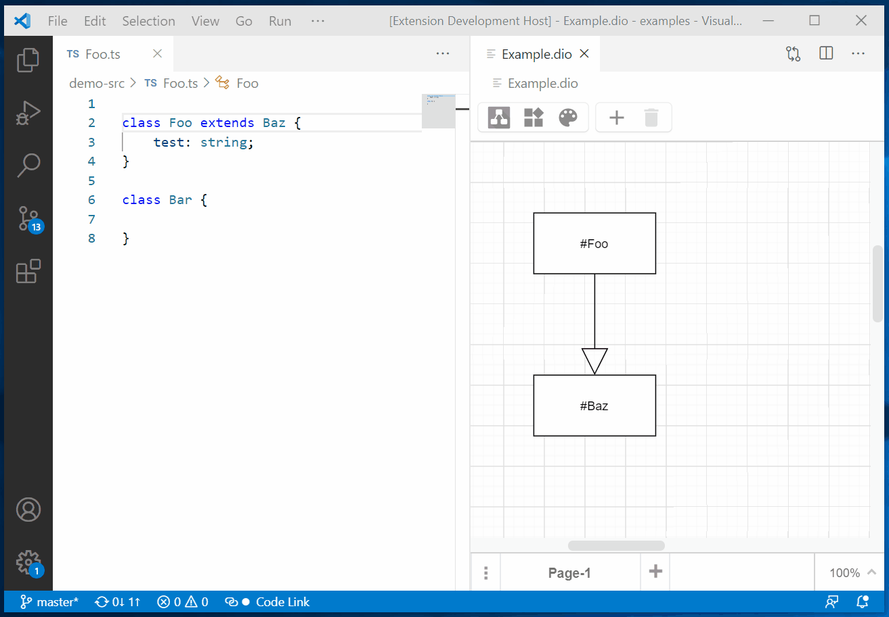
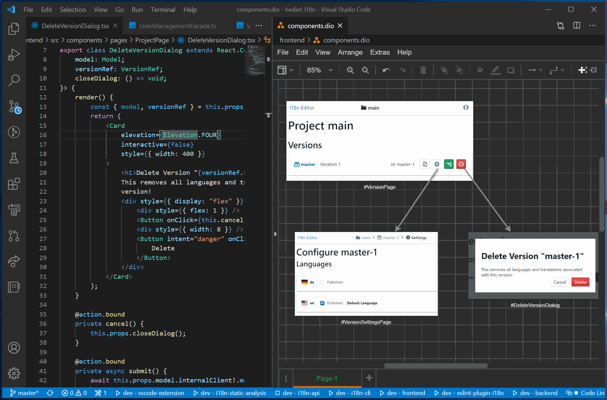

# VS Code Draw.io Integration - Code Links (Since 0.7.2)

The Code Link feature lets you link Draw.io nodes and edges to source code symbols.
Just name a node or edge `#MySymbol` where `MySymbol` is the name of the symbol you want to link to.
When code link is enabled (see the status bar) and you double click on a node or edge whith such a label, you will jump to the symbol definition.

Disable Code Link or select a node and press F2 if you want to change the label.

This feature works with any programming language that implements the VS Code workspace symbol search.
In TypeScript, symbols are functions, classes, consts, interfaces, ...

Code Links also work for `*.drawio.png` and `*.drawio.svg` files which are plain `*.png` and `*.svg` files with embedded Draw.io metadata that can be put on Github.
The Code Link Feature does not work on Github though.

## Link Screenshots with Symbols

Since you can directly paste images into Draw.io diagrams, you can use this feature to connect
screenshots of react components to their source:

## Applications

This feature can be used in many ways:

-   for documentation
-   for quick code navigation (like visual bookmarks)
-   for diagram based code tours

## Thank You

Thank you to Draw.io for being so open and enabling this kind of stuff, thank you to all the Contributors of this extension and thank you so much for my Sponsors on Github that really motivate me implementing features like this!
