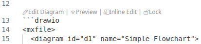
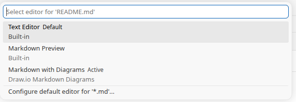
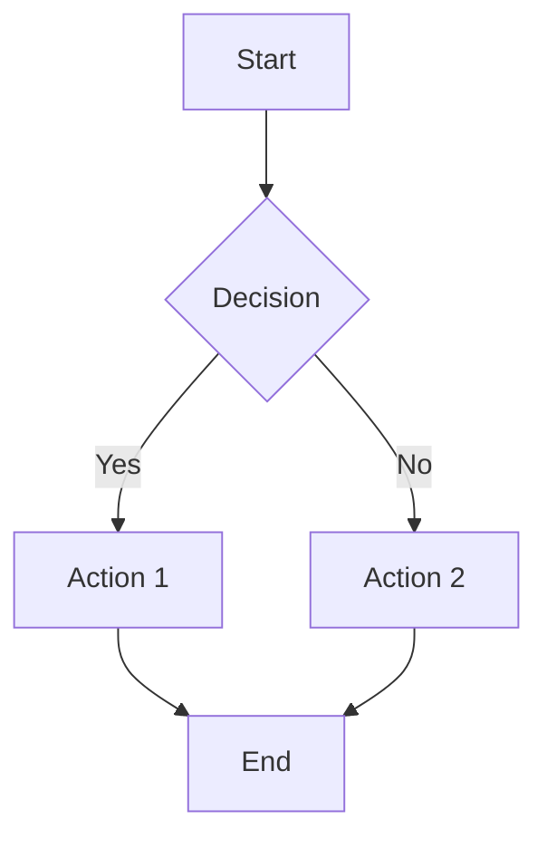

# Draw.io Markdown Diagrams - Test File

## Diagrams as First-Class Markdown Content

This extension embeds editable draw.io diagrams directly in Markdown as fenced mxfile XML blocks — version-controlled and diffable.

Unlike text-to-diagram DSLs, the mxfile format encodes a full graph structure: typed nodes and edges, explicit geometry, hierarchical parent-child relationships, and extensible metadata on every element. This makes the XML machine-readable in ways DSLs are not — LLMs can parse, produce, and semantically diff diagram changes (added nodes, changed connections, moved components) without specialized tooling.

## Screenshots

### Code Lenses

Each `drawio` code block gets inline CodeLens actions (Edit, Inline Edit, Preview, Lock/Unlock) directly above the block. Edit opens the diagram in a new tab, while Inline Edit opens the Markdown Editor and scrolls to the diagram, activating the inline editor.



### Markdown Editor

Right-click any `.md` file and choose "Open With..." to open it with the Draw.io Markdown Editor. This is an experimental, very simple editor to showcase the inline diagram editing experience:



### Built-in Markdown Preview

Draw.io code blocks are rendered as diagram previews in VS Code's built-in Markdown preview.

## 1. Basic Fenced Diagram (Unlocked)

Click the CodeLens above the block to edit, preview, or lock this diagram.

```drawio width=902
<mxfile>
  <diagram name="Seite-1" id="xbm4RRNwNYeADpPKO8R9">
    <mxGraphModel dx="-29.38" dy="-10.04" grid="1" gridSize="10" guides="1" tooltips="1" connect="1" arrows="1" fold="1" page="1" pageScale="1" pageWidth="1200" pageHeight="700" math="0" shadow="0">
      <root>
        <mxCell id="0" />
        <mxCell id="1" parent="0" />
        <mxCell id="title" parent="1" style="text;html=1;fontSize=18;fontStyle=1;align=center;verticalAlign=middle;fillColor=none;strokeColor=none;fontColor=#333333;" value="Draw.io Markdown Diagrams — VS Code Extension Architecture" vertex="1">
          <mxGeometry height="40" width="600" x="299.88" y="-0.23999999999999844" as="geometry" />
        </mxCell>
        <mxCell id="vscode" parent="1" style="swimlane;startSize=30;fillColor=#dae8fc;strokeColor=#6c8ebf;rounded=1;arcSize=8;fontSize=14;fontStyle=1;swimlaneLine=1;collapsible=0;" value="VS Code Host" vertex="1">
          <mxGeometry height="610" width="520" x="40" y="60" as="geometry" />
        </mxCell>
        <mxCell id="ext" parent="vscode" style="swimlane;startSize=28;fillColor=#e1d5e7;strokeColor=#9673a6;rounded=1;arcSize=8;fontSize=12;fontStyle=1;collapsible=0;" value="Extension (src/extension.js)" vertex="1">
          <mxGeometry height="200" width="480" x="20" y="50" as="geometry" />
        </mxCell>
        <mxCell id="commands" parent="ext" style="rounded=1;whiteSpace=wrap;html=0;fillColor=#fff2cc;strokeColor=#d6b656;fontSize=11;align=center;verticalAlign=middle;spacingTop=2;" value="Commands&#xa;&#xa;insertDiagram&#xa;editDiagram&#xa;toggleLock" vertex="1">
          <mxGeometry height="140" width="130" x="20" y="40" as="geometry" />
        </mxCell>
        <mxCell id="codelens" parent="ext" style="rounded=1;whiteSpace=wrap;html=0;fillColor=#fff2cc;strokeColor=#d6b656;fontSize=11;align=center;verticalAlign=middle;spacingTop=2;" value="CodeLens&#xa;Provider&#xa;&#xa;Edit / Lock&#xa;actions above&#xa;diagram blocks" vertex="1">
          <mxGeometry height="140" width="130" x="170" y="40" as="geometry" />
        </mxCell>
        <mxCell id="webviewMgr" parent="ext" style="rounded=1;whiteSpace=wrap;html=0;fillColor=#fff2cc;strokeColor=#d6b656;fontSize=11;align=center;verticalAlign=middle;spacingTop=2;" value="Webview&#xa;Panel Manager&#xa;&#xa;Creates &amp; manages&#xa;editor panels" vertex="1">
          <mxGeometry height="140" width="140" x="320" y="40" as="geometry" />
        </mxCell>
        <mxCell id="pureGroup" connectable="0" parent="vscode" style="group;" value="" vertex="1">
          <mxGeometry height="120" width="480" x="20" y="300" as="geometry" />
        </mxCell>
        <mxCell id="parser" parent="pureGroup" style="rounded=1;whiteSpace=wrap;html=0;fillColor=#d5e8d4;strokeColor=#82b366;fontSize=11;align=center;verticalAlign=middle;spacingTop=2;" value="diagramParser.js&#xa;&#xa;Parse, build &amp; replace&#xa;diagram blocks in Markdown&#xa;(pure functions)" vertex="1">
          <mxGeometry height="120" width="210" as="geometry" />
        </mxCell>
        <mxCell id="lock" parent="pureGroup" style="rounded=1;whiteSpace=wrap;html=0;fillColor=#d5e8d4;strokeColor=#82b366;fontSize=11;align=center;verticalAlign=middle;spacingTop=2;" value="diagramLock.js&#xa;&#xa;Lock / unlock toggle&#xa;and state checking&#xa;(pure functions)" vertex="1">
          <mxGeometry height="120" width="210" x="270" as="geometry" />
        </mxCell>
        <mxCell id="e3" edge="1" parent="pureGroup" source="lock" style="edgeStyle=elbowEdgeStyle;rounded=1;strokeColor=#82b366;strokeWidth=1.5;elbow=vertical;" target="parser">
          <mxGeometry relative="1" as="geometry" />
        </mxCell>
        <mxCell id="e3label" connectable="0" parent="e3" style="edgeLabel;html=1;fontSize=10;fontColor=#666666;fillColor=none;" value="depends on" vertex="1">
          <mxGeometry relative="1" as="geometry">
            <mxPoint x="-30" as="offset" />
          </mxGeometry>
        </mxCell>
        <mxCell id="mdfile" parent="vscode" style="shape=document;whiteSpace=wrap;html=0;fillColor=#f5f5f5;strokeColor=#666666;fontSize=11;align=center;verticalAlign=middle;fontColor=#333333;size=0.15;rounded=0;" value="Markdown File (.md)&#xa;&#xa;```drawio&#xa;&lt;mxfile&gt;...&lt;/mxfile&gt;&#xa;```" vertex="1">
          <mxGeometry height="120" width="200" x="164" y="464" as="geometry" />
        </mxCell>
        <mxCell id="e1" edge="1" parent="vscode" source="ext" style="edgeStyle=elbowEdgeStyle;rounded=1;strokeColor=#6c8ebf;strokeWidth=1.5;" target="parser">
          <mxGeometry relative="1" as="geometry" />
        </mxCell>
        <mxCell id="e1label" connectable="0" parent="e1" style="edgeLabel;html=1;fontSize=10;fontColor=#666666;fillColor=none;" value="calls" vertex="1">
          <mxGeometry relative="1" x="-0.2" as="geometry">
            <mxPoint y="-9" as="offset" />
          </mxGeometry>
        </mxCell>
        <mxCell id="e2" edge="1" parent="vscode" source="ext" style="edgeStyle=elbowEdgeStyle;rounded=1;strokeColor=#6c8ebf;strokeWidth=1.5;" target="lock">
          <mxGeometry relative="1" as="geometry" />
        </mxCell>
        <mxCell id="e2label" connectable="0" parent="e2" style="edgeLabel;html=1;fontSize=10;fontColor=#666666;fillColor=none;" value="calls" vertex="1">
          <mxGeometry relative="1" x="-0.2" as="geometry">
            <mxPoint x="-29" y="-10" as="offset" />
          </mxGeometry>
        </mxCell>
        <mxCell id="e4" edge="1" parent="vscode" source="parser" style="edgeStyle=orthogonalEdgeStyle;rounded=1;strokeColor=#666666;strokeWidth=1.5;" target="mdfile">
          <mxGeometry relative="1" as="geometry">
            <Array as="points">
              <mxPoint x="125" y="518" />
            </Array>
          </mxGeometry>
        </mxCell>
        <mxCell id="e4label" connectable="0" parent="e4" style="edgeLabel;html=1;fontSize=10;fontColor=#666666;fillColor=none;" value="parse / replace" vertex="1">
          <mxGeometry relative="1" as="geometry">
            <mxPoint x="-77" y="-36" as="offset" />
          </mxGeometry>
        </mxCell>
        <mxCell id="webview" parent="1" style="swimlane;startSize=28;fillColor=#f8cecc;strokeColor=#b85450;rounded=1;arcSize=8;fontSize=12;fontStyle=1;collapsible=0;" value="Webview Panel (src/webview/editor.html)" vertex="1">
          <mxGeometry height="250" width="480" x="610" y="80" as="geometry" />
        </mxCell>
        <mxCell id="editorhtml" parent="webview" style="rounded=1;whiteSpace=wrap;html=0;fillColor=#FFFFFF;strokeColor=#b85450;fontSize=11;align=center;verticalAlign=middle;spacingTop=2;" value="editor.html&#xa;&#xa;Self-contained webview&#xa;with CSP restrictions&#xa;Manages iframe lifecycle" vertex="1">
          <mxGeometry height="130" width="200" x="20" y="40" as="geometry" />
        </mxCell>
        <mxCell id="drawio" parent="webview" style="rounded=1;whiteSpace=wrap;html=0;fillColor=#FFFFFF;strokeColor=#b85450;fontSize=11;align=center;verticalAlign=middle;spacingTop=2;dashed=1;dashPattern=8 4;" value="draw.io iframe&#xa;&#xa;embed.diagrams.net&#xa;Embed mode protocol" vertex="1">
          <mxGeometry height="130" width="200" x="262" y="40" as="geometry" />
        </mxCell>
        <mxCell id="e6" edge="1" parent="webview" source="editorhtml" style="edgeStyle=elbowEdgeStyle;rounded=1;strokeColor=#b85450;strokeWidth=1.5;exitX=1;exitY=0.5;exitDx=0;exitDy=0;entryX=0;entryY=0.5;entryDx=0;entryDy=0;elbow=vertical;" target="drawio">
          <mxGeometry relative="1" as="geometry" />
        </mxCell>
        <mxCell id="e6label" connectable="0" parent="e6" style="edgeLabel;html=1;fontSize=10;fontColor=#666666;fillColor=none;" value="postMessage" vertex="1">
          <mxGeometry relative="1" as="geometry">
            <mxPoint x="-33" y="3" as="offset" />
          </mxGeometry>
        </mxCell>
        <mxCell id="legend" parent="webview" style="shape=note;whiteSpace=wrap;html=0;fillColor=#FFFDE7;strokeColor=#d6b656;fontSize=10;align=center;verticalAlign=middle;size=14;" value="Embed Mode Protocol:&#xa;init → load → save/autosave/exit" vertex="1">
          <mxGeometry height="50" width="240" x="130" y="185" as="geometry" />
        </mxCell>
        <mxCell id="drawioCloud" parent="1" style="shape=cloud;whiteSpace=wrap;html=0;fillColor=#e6e6e6;strokeColor=#999999;fontSize=11;align=center;verticalAlign=middle;fontColor=#333333;" value="embed.diagrams.net&#xa;(External Service)" vertex="1">
          <mxGeometry height="120" width="220" x="890" y="420" as="geometry" />
        </mxCell>
        <mxCell id="tests" parent="1" style="rounded=1;whiteSpace=wrap;html=0;fillColor=#e6e6e6;strokeColor=#999999;fontSize=11;align=center;verticalAlign=middle;fontStyle=0;dashed=1;dashPattern=8 4;" value="Test Suite (Mocha)&#xa;&#xa;diagramParser.test.js&#xa;diagramLock.test.js" vertex="1">
          <mxGeometry height="100" width="180" x="670" y="430" as="geometry" />
        </mxCell>
        <mxCell id="e5" edge="1" parent="1" source="webviewMgr" style="edgeStyle=elbowEdgeStyle;rounded=1;strokeColor=#b85450;strokeWidth=1.5;elbow=vertical;" target="editorhtml">
          <mxGeometry relative="1" as="geometry" />
        </mxCell>
        <mxCell id="e5label" connectable="0" parent="e5" style="edgeLabel;html=1;fontSize=10;fontColor=#666666;fillColor=none;" value="creates &amp; messages" vertex="1">
          <mxGeometry relative="1" as="geometry">
            <mxPoint x="-40" y="7" as="offset" />
          </mxGeometry>
        </mxCell>
        <mxCell id="e7" edge="1" parent="1" source="drawio" style="edgeStyle=elbowEdgeStyle;rounded=1;strokeColor=#999999;strokeWidth=1.5;dashed=1;dashPattern=8 4;" target="drawioCloud">
          <mxGeometry relative="1" as="geometry">
            <Array as="points">
              <mxPoint x="1013" y="342" />
            </Array>
          </mxGeometry>
        </mxCell>
        <mxCell id="e7label" connectable="0" parent="e7" style="edgeLabel;html=1;fontSize=10;fontColor=#666666;fillColor=none;" value="loads editor" vertex="1">
          <mxGeometry relative="1" as="geometry">
            <mxPoint x="-40" y="15" as="offset" />
          </mxGeometry>
        </mxCell>
        <mxCell id="e8" edge="1" parent="1" source="tests" style="edgeStyle=elbowEdgeStyle;rounded=1;strokeColor=#999999;strokeWidth=1.5;dashed=1;dashPattern=8 4;elbow=vertical;" target="vscode">
          <mxGeometry relative="1" as="geometry">
            <mxPoint x="490" y="570" as="targetPoint" />
          </mxGeometry>
        </mxCell>
        <mxCell id="e8label" connectable="0" parent="e8" style="edgeLabel;html=1;fontSize=10;fontColor=#666666;fillColor=none;" value="unit tests" vertex="1">
          <mxGeometry relative="1" as="geometry">
            <mxPoint x="-23" y="-24" as="offset" />
          </mxGeometry>
        </mxCell>
      </root>
    </mxGraphModel>
  </diagram>
</mxfile>

```
## 2. Locked Fenced Diagram

This diagram should show as locked. Use the CodeLens to unlock it before editing.

```drawio locked
<mxfile>
  <diagram id="locked-fenced" name="Locked">
    <mxGraphModel>
      <root>
        <mxCell id="0"/>
        <mxCell id="1" parent="0"/>
        <mxCell id="2" value="LOCKED" style="rounded=1;whiteSpace=wrap;html=1;fillColor=#fff2cc;strokeColor=#d6b656;fontSize=16;fontStyle=1;" vertex="1" parent="1">
          <mxGeometry x="100" y="100" width="200" height="80" as="geometry"/>
        </mxCell>
      </root>
    </mxGraphModel>
  </diagram>
</mxfile>
```

## 3. HTML Comment Diagram (Unlocked)

Alternative syntax using HTML comments. Should also show CodeLens actions.

<!-- drawio:start -->
<mxfile>
  <diagram id="comment-unlocked" name="Comment">
    <mxGraphModel dx="-84" dy="-84" grid="1" gridSize="10" guides="1" tooltips="1" connect="1" arrows="1" fold="1" page="1" pageScale="1" pageWidth="827" pageHeight="1169" math="0" shadow="0">
      <root>
        <mxCell id="0" />
        <mxCell id="1" parent="0" />
        <mxCell id="2" parent="1" style="shape=umlActor;verticalLabelPosition=bottom;verticalAlign=top;html=1;" value="User" vertex="1">
          <mxGeometry height="55" width="30" x="100" y="100" as="geometry" />
        </mxCell>
        <mxCell id="3" parent="1" style="rounded=1;whiteSpace=wrap;html=1;fillColor=#dae8fc;strokeColor=#6c8ebf;" value="System" vertex="1">
          <mxGeometry height="40" width="120" x="210" y="107.5" as="geometry" />
        </mxCell>
        <mxCell id="4" edge="1" parent="1" source="2" style="endArrow=classic;html=1;" target="3">
          <mxGeometry relative="1" as="geometry" />
        </mxCell>
      </root>
    </mxGraphModel>
  </diagram>
</mxfile>

<!-- drawio:end -->
## 4. Locked HTML Comment Diagram

<!-- drawio:start locked -->
<mxfile>
  <diagram id="comment-locked" name="Locked Comment">
    <mxGraphModel>
      <root>
        <mxCell id="0"/>
        <mxCell id="1" parent="0"/>
        <mxCell id="2" value="Do not edit" style="text;html=1;align=center;verticalAlign=middle;resizable=0;points=[];autosize=1;fontStyle=2;" vertex="1" parent="1">
          <mxGeometry x="100" y="100" width="90" height="30" as="geometry"/>
        </mxCell>
      </root>
    </mxGraphModel>
  </diagram>
</mxfile>
<!-- drawio:end -->
## 5. Multiple Diagrams in Sequence

Testing that multiple consecutive blocks are each detected independently.

```drawio
<mxfile>
  <diagram id="multi-a" name="Box A">
    <mxGraphModel dx="560" dy="807" grid="0" gridSize="10" guides="1" tooltips="1" connect="1" arrows="1" fold="1" page="0" pageScale="1" pageWidth="827" pageHeight="1169" math="0" shadow="0">
      <root>
        <mxCell id="0" />
        <mxCell id="1" parent="0" />
        <mxCell id="2" parent="1" style="rounded=1;whiteSpace=wrap;html=1;fillColor=#dae8fc;strokeColor=#6c8ebf;fontSize=24;" value="A" vertex="1">
          <mxGeometry height="80" width="80" x="100" y="100" as="geometry" />
        </mxCell>
      </root>
    </mxGraphModel>
  </diagram>
</mxfile>
```
```drawio
<mxfile>
  <diagram id="multi-b" name="Box B">
    <mxGraphModel dx="345" dy="-83" grid="0" gridSize="10" guides="1" tooltips="1" connect="1" arrows="1" fold="1" page="0" pageScale="1" pageWidth="827" pageHeight="1169" math="0" shadow="0">
      <root>
        <mxCell id="0" />
        <mxCell id="1" parent="0" />
        <mxCell id="2" parent="1" style="rounded=1;whiteSpace=wrap;html=1;fillColor=#d5e8d4;strokeColor=#82b366;fontSize=24;" value="D" vertex="1">
          <mxGeometry height="80" width="80" x="71" y="111" as="geometry" />
        </mxCell>
      </root>
    </mxGraphModel>
  </diagram>
</mxfile>

```
## 6. Empty Diagram Placeholder

Insert a new diagram here using the `Draw.io: Insert Diagram` command (Ctrl+Shift+P).

## 7. Regular Markdown (No Diagrams)

This section has no diagrams. The extension should not show any CodeLens here.

- Bullet point one
- Bullet point two

```javascript
// Regular code block — should be ignored by the extension
console.log("not a diagram");
```

> A blockquote with no diagrams.

```drawio
<mxfile>
  <diagram id="default" name="Page-1">
    <mxGraphModel dx="552" dy="67" grid="0" gridSize="10" guides="1" tooltips="1" connect="1" arrows="1" fold="1" page="0" pageScale="1" pageWidth="827" pageHeight="1169" math="0" shadow="0">
      <root>
        <mxCell id="0" />
        <mxCell id="1" parent="0" />
        <mxCell id="2" parent="1" style="whiteSpace=wrap;html=1;" value="" vertex="1">
          <mxGeometry height="60" width="120" x="-273" y="-27" as="geometry" />
        </mxCell>
        <mxCell id="3" parent="1" style="ellipse;whiteSpace=wrap;html=1;" value="" vertex="1">
          <mxGeometry height="60" width="60" x="-3" y="-27" as="geometry" />
        </mxCell>
        <mxCell id="4" edge="1" parent="1" source="2" style="edgeStyle=none;curved=1;rounded=0;orthogonalLoop=1;jettySize=auto;html=1;fontSize=12;startSize=8;endSize=8;" target="3" value="">
          <mxGeometry relative="1" as="geometry" />
        </mxCell>
      </root>
    </mxGraphModel>
  </diagram>
</mxfile>
```

## 8. Mermaid Conversion

Click the "Convert to draw.io" CodeLens above the mermaid block to convert it to a draw.io diagram. The original mermaid source is preserved in the draw.io model root cell metadata under `mermaidSource`.



## 9. Last Diagram on Page

Testing that resizing the last diagram on the page works.

```drawio
<mxfile>
  <diagram id="multi-a" name="Box A">
    <mxGraphModel dx="560" dy="807" grid="0" gridSize="10" guides="1" tooltips="1" connect="1" arrows="1" fold="1" page="0" pageScale="1" pageWidth="827" pageHeight="1169" math="0" shadow="0">
      <root>
        <mxCell id="0" />
        <mxCell id="1" parent="0" />
        <mxCell id="2" parent="1" style="rounded=1;whiteSpace=wrap;html=1;fillColor=#e1d5e7;strokeColor=#9673a6;fontSize=24;" value="A" vertex="1">
          <mxGeometry height="80" width="80" x="100" y="100" as="geometry" />
        </mxCell>
      </root>
    </mxGraphModel>
  </diagram>
</mxfile>
```
