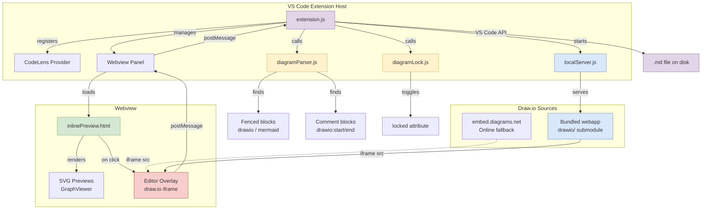

# Draw.io Markdown Diagrams — Feature Showcase

This document demonstrates the full capabilities of the **Draw.io Markdown Diagrams** VS Code extension. Diagrams are stored as inline XML directly in the Markdown source, making them version-control friendly and editable without leaving your editor.

```drawio width=1018
<mxfile>
  <diagram id="36wVBNfcrbbWwZ5o2jee" name="Page-1">
    <mxGraphModel dx="-12" dy="4" grid="0" gridSize="10" guides="1" tooltips="1" connect="1" arrows="1" fold="1" page="1" pageScale="1" pageWidth="827" pageHeight="1169" math="0" shadow="0">
      <root>
        <mxCell id="0" />
        <mxCell id="1" parent="0" />
        <mxCell id="title" parent="1" style="text;html=1;fontSize=20;fontStyle=1;align=center;verticalAlign=middle;fillColor=none;strokeColor=none;fontColor=#1a1a2e;" value="Draw.io Markdown Diagrams — VS Code Extension Architecture" vertex="1">
          <mxGeometry height="40" width="1276" x="40" y="22" as="geometry" />
        </mxCell>
        <mxCell id="vscodeHost" parent="1" style="swimlane;startSize=30;fillColor=#dae8fc;strokeColor=#6c8ebf;fontStyle=1;fontSize=14;rounded=1;arcSize=8;shadow=1;" value="VS Code Host" vertex="1">
          <mxGeometry height="520" width="520" x="40" y="80" as="geometry" />
        </mxCell>
        <mxCell id="extension" parent="vscodeHost" style="rounded=1;whiteSpace=wrap;html=1;fillColor=#fff2cc;strokeColor=#d6b656;shadow=1;fontSize=12;verticalAlign=middle;spacingTop=2;spacingBottom=2;" value="&lt;b&gt;extension.js&lt;/b&gt;&lt;br&gt;&lt;font style=&quot;font-size:10px&quot;&gt;Commands · CodeLens · URI Handler&lt;br&gt;Custom Editors · Decorations&lt;/font&gt;" vertex="1">
          <mxGeometry height="70" width="280" x="120" y="60" as="geometry" />
        </mxCell>
        <mxCell id="parser" parent="vscodeHost" style="rounded=1;whiteSpace=wrap;html=1;fillColor=#e1d5e7;strokeColor=#9673a6;shadow=1;fontSize=12;" value="&lt;b&gt;diagramParser.js&lt;/b&gt;&lt;br&gt;&lt;font style=&quot;font-size:10px&quot;&gt;Find · Build · Replace Blocks&lt;br&gt;Fenced &amp;amp; Comment Formats&lt;/font&gt;" vertex="1">
          <mxGeometry height="65" width="220" x="30" y="180" as="geometry" />
        </mxCell>
        <mxCell id="lock" parent="vscodeHost" style="rounded=1;whiteSpace=wrap;html=1;fillColor=#e1d5e7;strokeColor=#9673a6;shadow=1;fontSize=12;" value="&lt;b&gt;diagramLock.js&lt;/b&gt;&lt;br&gt;&lt;font style=&quot;font-size:10px&quot;&gt;Toggle · Check · Set Lock State&lt;/font&gt;" vertex="1">
          <mxGeometry height="65" width="210" x="280" y="180" as="geometry" />
        </mxCell>
        <mxCell id="server" parent="vscodeHost" style="rounded=1;whiteSpace=wrap;html=1;fillColor=#d5e8d4;strokeColor=#82b366;shadow=1;fontSize=12;" value="&lt;b&gt;localServer.js&lt;/b&gt;&lt;br&gt;&lt;font style=&quot;font-size:10px&quot;&gt;Static HTTP · 127.0.0.1&lt;br&gt;CORS · Mime Types&lt;/font&gt;" vertex="1">
          <mxGeometry height="65" width="200" x="30" y="290" as="geometry" />
        </mxCell>
        <mxCell id="mdFile" parent="vscodeHost" style="shape=document;whiteSpace=wrap;html=1;fillColor=#f5f5f5;strokeColor=#666666;shadow=1;fontSize=12;size=0.15;fontColor=#333333;" value="&lt;b&gt;Markdown File&lt;/b&gt;&lt;br&gt;&lt;font style=&quot;font-size:10px&quot;&gt;.md with inline XML blocks&lt;/font&gt;" vertex="1">
          <mxGeometry height="80" width="180" x="30" y="410" as="geometry" />
        </mxCell>
        <mxCell id="vscodeApi" parent="vscodeHost" style="rounded=1;whiteSpace=wrap;html=1;fillColor=#f8cecc;strokeColor=#b85450;shadow=1;fontSize=12;" value="&lt;b&gt;VS Code API&lt;/b&gt;&lt;br&gt;&lt;font style=&quot;font-size:10px&quot;&gt;Workspace Edits&lt;br&gt;Text Decorations&lt;/font&gt;" vertex="1">
          <mxGeometry height="70" width="200" x="280" y="410" as="geometry" />
        </mxCell>
        <mxCell id="e1" edge="1" parent="vscodeHost" source="extension" style="edgeStyle=orthogonalEdgeStyle;rounded=1;strokeColor=#9673a6;strokeWidth=1.5;exitX=0.25;exitY=1;entryX=0.5;entryY=0;" target="parser">
          <mxGeometry relative="1" as="geometry" />
        </mxCell>
        <mxCell id="e2" edge="1" parent="vscodeHost" source="extension" style="edgeStyle=orthogonalEdgeStyle;rounded=1;strokeColor=#9673a6;strokeWidth=1.5;exitX=0.75;exitY=1;entryX=0.5;entryY=0;" target="lock">
          <mxGeometry relative="1" as="geometry" />
        </mxCell>
        <mxCell id="e3" edge="1" parent="vscodeHost" source="extension" style="edgeStyle=orthogonalEdgeStyle;rounded=1;strokeColor=#82b366;strokeWidth=1.5;entryX=0.5;entryY=0;" target="server">
          <mxGeometry relative="1" as="geometry">
            <Array as="points">
              <mxPoint x="10" y="99" />
              <mxPoint x="10" y="270" />
              <mxPoint x="130" y="270" />
            </Array>
          </mxGeometry>
        </mxCell>
        <mxCell id="e4" edge="1" parent="vscodeHost" source="parser" style="edgeStyle=elbowEdgeStyle;rounded=1;strokeColor=#666666;strokeWidth=1.5;" target="mdFile" value="parse / replace">
          <mxGeometry relative="1" x="-0.0218" y="23" as="geometry">
            <mxPoint as="offset" />
            <Array as="points">
              <mxPoint x="260" y="340" />
            </Array>
          </mxGeometry>
        </mxCell>
        <mxCell id="e5" edge="1" parent="vscodeHost" source="extension" style="edgeStyle=orthogonalEdgeStyle;rounded=1;strokeColor=#b85450;strokeWidth=1.5;exitX=1;exitY=0.75;entryX=0.5;entryY=0;" target="vscodeApi">
          <mxGeometry relative="1" as="geometry">
            <Array as="points">
              <mxPoint x="420" y="155" />
              <mxPoint x="500" y="155" />
              <mxPoint x="500" y="380" />
              <mxPoint x="380" y="380" />
            </Array>
          </mxGeometry>
        </mxCell>
        <mxCell id="webviewLayer" parent="1" style="swimlane;startSize=30;fillColor=#fff2cc;strokeColor=#d6b656;fontStyle=1;fontSize=14;rounded=1;arcSize=8;shadow=1;" value="Webview Layer (Sandboxed)" vertex="1">
          <mxGeometry height="300" width="480" x="620" y="80" as="geometry" />
        </mxCell>
        <mxCell id="modalEditor" parent="webviewLayer" style="rounded=1;whiteSpace=wrap;html=1;fillColor=#fff2cc;strokeColor=#d6b656;shadow=1;fontSize=12;" value="&lt;b&gt;editor.html&lt;/b&gt;&lt;br&gt;&lt;font style=&quot;font-size:10px&quot;&gt;Modal Editor Panel&lt;br&gt;Load → Edit → Save/Exit&lt;/font&gt;" vertex="1">
          <mxGeometry height="70" width="190" x="30" y="60" as="geometry" />
        </mxCell>
        <mxCell id="inlinePreview" parent="webviewLayer" style="rounded=1;whiteSpace=wrap;html=1;fillColor=#fff2cc;strokeColor=#d6b656;shadow=1;fontSize=12;" value="&lt;b&gt;inlinePreview.html&lt;/b&gt;&lt;br&gt;&lt;font style=&quot;font-size:10px&quot;&gt;3-Tier Architecture&lt;/font&gt;" vertex="1">
          <mxGeometry height="70" width="190" x="260" y="60" as="geometry" />
        </mxCell>
        <mxCell id="tier1" parent="webviewLayer" style="rounded=1;whiteSpace=wrap;html=1;fillColor=#e6ffe6;strokeColor=#82b366;fontSize=11;shadow=0;" value="&lt;font style=&quot;font-size:10px&quot;&gt;① SVG Preview&lt;br&gt;&lt;i&gt;viewer-static.min.js&lt;/i&gt;&lt;/font&gt;" vertex="1">
          <mxGeometry height="38" width="190" x="260" y="150" as="geometry" />
        </mxCell>
        <mxCell id="tier2" parent="webviewLayer" style="rounded=1;whiteSpace=wrap;html=1;fillColor=#ffe6cc;strokeColor=#d6b656;fontSize=11;shadow=0;" value="&lt;font style=&quot;font-size:10px&quot;&gt;② Overlay Editor&lt;br&gt;&lt;i&gt;Singleton iframe&lt;/i&gt;&lt;/font&gt;" vertex="1">
          <mxGeometry height="38" width="190" x="260" y="200" as="geometry" />
        </mxCell>
        <mxCell id="tier3" parent="webviewLayer" style="rounded=1;whiteSpace=wrap;html=1;fillColor=#f8cecc;strokeColor=#b85450;fontSize=11;shadow=0;" value="&lt;font style=&quot;font-size:10px&quot;&gt;③ Save &amp;amp; Close&lt;br&gt;&lt;i&gt;XML → SVG regeneration&lt;/i&gt;&lt;/font&gt;" vertex="1">
          <mxGeometry height="38" width="190" x="260" y="250" as="geometry" />
        </mxCell>
        <mxCell id="Sh3pKC0F2qFwc_NwnPTL-2" edge="1" parent="webviewLayer" source="mermaid" style="edgeStyle=orthogonalEdgeStyle;rounded=0;orthogonalLoop=1;jettySize=auto;html=1;" target="modalEditor" value="">
          <mxGeometry relative="1" as="geometry" />
        </mxCell>
        <mxCell id="Sh3pKC0F2qFwc_NwnPTL-3" edge="1" parent="webviewLayer" source="mermaid" style="edgeStyle=orthogonalEdgeStyle;rounded=0;orthogonalLoop=1;jettySize=auto;html=1;" target="modalEditor" value="">
          <mxGeometry relative="1" as="geometry" />
        </mxCell>
        <mxCell id="mermaid" parent="webviewLayer" style="rounded=1;whiteSpace=wrap;html=1;fillColor=#e1d5e7;strokeColor=#9673a6;fontSize=11;shadow=1;dashed=1;" value="&lt;font style=&quot;font-size:10px&quot;&gt;Mermaid Support&lt;br&gt;&lt;i&gt;Detect · Convert · Edit&lt;/i&gt;&lt;/font&gt;" vertex="1">
          <mxGeometry height="45" width="190" x="30" y="180" as="geometry" />
        </mxCell>
        <mxCell id="ta1" edge="1" parent="webviewLayer" source="tier1" style="edgeStyle=orthogonalEdgeStyle;rounded=0;strokeColor=#999;strokeWidth=1;exitX=0.5;exitY=1;entryX=0.5;entryY=0;" target="tier2">
          <mxGeometry relative="1" as="geometry" />
        </mxCell>
        <mxCell id="ta2" edge="1" parent="webviewLayer" source="tier2" style="edgeStyle=orthogonalEdgeStyle;rounded=0;strokeColor=#999;strokeWidth=1;exitX=0.5;exitY=1;entryX=0.5;entryY=0;" target="tier3">
          <mxGeometry relative="1" as="geometry" />
        </mxCell>
        <mxCell id="drawioEngine" parent="1" style="swimlane;startSize=30;fillColor=#d5e8d4;strokeColor=#82b366;fontStyle=1;fontSize=14;rounded=1;arcSize=8;shadow=1;" value="Draw.io Engine" vertex="1">
          <mxGeometry height="200" width="480" x="620" y="400" as="geometry" />
        </mxCell>
        <mxCell id="bundledApp" parent="drawioEngine" style="rounded=1;whiteSpace=wrap;html=1;fillColor=#d5e8d4;strokeColor=#82b366;shadow=1;fontSize=12;" value="&lt;b&gt;Bundled Webapp&lt;/b&gt;&lt;br&gt;&lt;font style=&quot;font-size:10px&quot;&gt;drawio/ git submodule&lt;br&gt;Full offline editor&lt;/font&gt;" vertex="1">
          <mxGeometry height="65" width="180" x="30" y="50" as="geometry" />
        </mxCell>
        <mxCell id="onlineMode" parent="drawioEngine" style="rounded=1;whiteSpace=wrap;html=1;fillColor=#d5e8d4;strokeColor=#82b366;shadow=1;fontSize=12;dashed=1;" value="&lt;b&gt;Online Fallback&lt;/b&gt;&lt;br&gt;&lt;font style=&quot;font-size:10px&quot;&gt;embed.diagrams.net&lt;br&gt;Configurable URL&lt;/font&gt;" vertex="1">
          <mxGeometry height="65" width="190" x="260" y="50" as="geometry" />
        </mxCell>
        <mxCell id="protocol" parent="drawioEngine" style="rounded=1;whiteSpace=wrap;html=1;fillColor=#f0f0f0;strokeColor=#999999;shadow=1;fontSize=11;" value="&lt;b&gt;Embed Mode Protocol&lt;/b&gt;&lt;br&gt;&lt;font style=&quot;font-size:10px&quot;&gt;postMessage · JSON&lt;br&gt;init → load → autosave → save → exit&lt;/font&gt;" vertex="1">
          <mxGeometry height="50" width="300" x="90" y="135" as="geometry" />
        </mxCell>
        <mxCell id="user" parent="1" style="shape=umlActor;verticalLabelPosition=bottom;verticalAlign=top;html=1;outlineConnect=0;fillColor=#dae8fc;strokeColor=#6c8ebf;shadow=1;fontSize=13;fontStyle=1;" value="&lt;b&gt;User&lt;/b&gt;" vertex="1">
          <mxGeometry height="60" width="40" x="1200" y="140" as="geometry" />
        </mxCell>
        <mxCell id="e6" edge="1" parent="1" source="extension" style="edgeStyle=orthogonalEdgeStyle;rounded=1;strokeColor=#d6b656;strokeWidth=2;dashed=1;exitX=1;exitY=0.25;" target="modalEditor" value="postMessage">
          <mxGeometry relative="1" as="geometry">
            <mxPoint as="offset" />
            <Array as="points">
              <mxPoint x="440" y="148" />
              <mxPoint x="590" y="148" />
              <mxPoint x="590" y="165" />
            </Array>
          </mxGeometry>
        </mxCell>
        <mxCell id="e7" edge="1" parent="1" source="extension" style="edgeStyle=orthogonalEdgeStyle;rounded=1;strokeColor=#d6b656;strokeWidth=2;dashed=1;" target="inlinePreview" value="postMessage">
          <mxGeometry relative="1" as="geometry">
            <mxPoint as="offset" />
            <Array as="points">
              <mxPoint x="300" y="120" />
              <mxPoint x="975" y="120" />
            </Array>
          </mxGeometry>
        </mxCell>
        <mxCell id="e8" edge="1" parent="1" source="server" style="edgeStyle=orthogonalEdgeStyle;rounded=1;strokeColor=#82b366;strokeWidth=1.5;" target="bundledApp" value="serves">
          <mxGeometry relative="1" as="geometry">
            <Array as="points">
              <mxPoint x="600" y="390" />
              <mxPoint x="600" y="500" />
            </Array>
          </mxGeometry>
        </mxCell>
        <mxCell id="e9" edge="1" parent="1" source="modalEditor" style="edgeStyle=orthogonalEdgeStyle;rounded=1;strokeColor=#82b366;strokeWidth=2;" target="bundledApp" value="iframe">
          <mxGeometry relative="1" as="geometry">
            <Array as="points">
              <mxPoint x="630" y="190" />
              <mxPoint x="630" y="483" />
            </Array>
          </mxGeometry>
        </mxCell>
        <mxCell id="e10" edge="1" parent="1" source="inlinePreview" style="edgeStyle=orthogonalEdgeStyle;rounded=1;strokeColor=#82b366;strokeWidth=2;dashed=1;" target="bundledApp">
          <mxGeometry relative="1" as="geometry">
            <Array as="points">
              <mxPoint x="860" y="180" />
              <mxPoint x="860" y="350" />
              <mxPoint x="795" y="350" />
            </Array>
          </mxGeometry>
        </mxCell>
        <mxCell id="e11" edge="1" parent="1" source="user" style="edgeStyle=orthogonalEdgeStyle;rounded=1;strokeColor=#6c8ebf;strokeWidth=1.5;exitX=0;exitY=0.5;entryX=1;entryY=0.5;" target="inlinePreview" value="click / edit">
          <mxGeometry relative="1" as="geometry" />
        </mxCell>
        <mxCell id="e12" edge="1" parent="1" source="user" style="edgeStyle=orthogonalEdgeStyle;rounded=1;strokeColor=#6c8ebf;strokeWidth=1.5;exitX=0;exitY=0.25;entryX=1;entryY=0.25;" target="modalEditor" value="CodeLens / Cmd">
          <mxGeometry relative="1" x="-0.6364" as="geometry">
            <mxPoint as="offset" />
            <Array as="points">
              <mxPoint x="1160" y="155" />
              <mxPoint x="1160" y="124" />
              <mxPoint x="860" y="124" />
              <mxPoint x="860" y="157" />
            </Array>
          </mxGeometry>
        </mxCell>
        <mxCell id="legend" parent="1" style="swimlane;startSize=0;fillColor=#fafafa;strokeColor=#cccccc;rounded=1;fontSize=11;fontStyle=0;" value="" vertex="1">
          <mxGeometry height="160" width="191" x="1122" y="436" as="geometry" />
        </mxCell>
        <mxCell id="legendTitle" parent="legend" style="text;html=1;fontSize=12;align=left;fillColor=none;strokeColor=none;" value="&lt;b&gt;Legend&lt;/b&gt;" vertex="1">
          <mxGeometry height="20" width="100" x="10" y="5" as="geometry" />
        </mxCell>
        <mxCell id="l1" parent="legend" style="rounded=1;fillColor=#fff2cc;strokeColor=#d6b656;shadow=0;" value="" vertex="1">
          <mxGeometry height="14" width="20" x="10" y="30" as="geometry" />
        </mxCell>
        <mxCell id="l1t" parent="legend" style="text;html=1;align=left;fillColor=none;strokeColor=none;" value="&lt;font style=&quot;font-size:10px&quot;&gt;Entry Point / UI&lt;/font&gt;" vertex="1">
          <mxGeometry height="20" width="143" x="40" y="21" as="geometry" />
        </mxCell>
        <mxCell id="l2" parent="legend" style="rounded=1;fillColor=#e1d5e7;strokeColor=#9673a6;shadow=0;" value="" vertex="1">
          <mxGeometry height="14" width="20" x="10" y="52" as="geometry" />
        </mxCell>
        <mxCell id="l2t" parent="legend" style="text;html=1;align=left;fillColor=none;strokeColor=none;" value="&lt;font style=&quot;font-size:10px&quot;&gt;Pure Logic (no VS Code dep)&lt;/font&gt;" vertex="1">
          <mxGeometry height="20" width="144" x="40" y="43" as="geometry" />
        </mxCell>
        <mxCell id="l3" parent="legend" style="rounded=1;fillColor=#d5e8d4;strokeColor=#82b366;shadow=0;" value="" vertex="1">
          <mxGeometry height="14" width="20" x="10" y="74" as="geometry" />
        </mxCell>
        <mxCell id="l3t" parent="legend" style="text;html=1;align=left;fillColor=none;strokeColor=none;" value="&lt;font style=&quot;font-size:10px&quot;&gt;Draw.io / Server&lt;/font&gt;" vertex="1">
          <mxGeometry height="20" width="141" x="40" y="65" as="geometry" />
        </mxCell>
        <mxCell id="l4" parent="legend" style="rounded=1;fillColor=#f8cecc;strokeColor=#b85450;shadow=0;" value="" vertex="1">
          <mxGeometry height="14" width="20" x="10" y="96" as="geometry" />
        </mxCell>
        <mxCell id="l4t" parent="legend" style="text;html=1;align=left;fillColor=none;strokeColor=none;" value="&lt;font style=&quot;font-size:10px&quot;&gt;VS Code API&lt;/font&gt;" vertex="1">
          <mxGeometry height="20" width="142" x="40" y="87" as="geometry" />
        </mxCell>
        <mxCell id="l5" edge="1" parent="legend" style="endArrow=classic;strokeColor=#d6b656;strokeWidth=2;dashed=1;" value="">
          <mxGeometry relative="1" as="geometry">
            <mxPoint x="10" y="125" as="sourcePoint" />
            <mxPoint x="30" y="125" as="targetPoint" />
          </mxGeometry>
        </mxCell>
        <mxCell id="l5t" parent="legend" style="text;html=1;align=left;fillColor=none;strokeColor=none;" value="&lt;font style=&quot;font-size:10px&quot;&gt;postMessage (async)&lt;/font&gt;" vertex="1">
          <mxGeometry height="20" width="141" x="40" y="111" as="geometry" />
        </mxCell>
        <mxCell id="l6" edge="1" parent="legend" style="endArrow=classic;strokeColor=#82b366;strokeWidth=2;" value="">
          <mxGeometry relative="1" as="geometry">
            <mxPoint x="10" y="147" as="sourcePoint" />
            <mxPoint x="30" y="147" as="targetPoint" />
          </mxGeometry>
        </mxCell>
        <mxCell id="l6t" parent="legend" style="text;html=1;align=left;fillColor=none;strokeColor=none;" value="&lt;font style=&quot;font-size:10px&quot;&gt;iframe / HTTP&lt;/font&gt;" vertex="1">
          <mxGeometry height="20" width="141" x="40" y="133" as="geometry" />
        </mxCell>
      </root>
    </mxGraphModel>
  </diagram>
</mxfile>
```
---

## 1. Use Case Diagram — Specification-Driven Development

The core idea behind diagram-enriched Markdown is that a single document serves as both the human-readable specification and the machine-readable source of truth. The use case diagram below captures the three main workflows: **authoring specifications** that combine prose with visual diagrams, **choosing diagram types** appropriate for the aspect of the system being described, and **iterating with AI** by leveraging the fact that both text and diagram XML live in the same file — an AI agent can read the full specification, understand diagram semantics, and propose changes to code or architecture based on what the diagrams express.

```drawio width=628
<mxfile>
  <diagram id="use-case-spec" name="Specification Use Cases">
    <mxGraphModel dx="-19" dy="7" grid="0" gridSize="10" guides="1" tooltips="1" connect="0" arrows="0" fold="0" page="0" pageScale="1" pageWidth="920" pageHeight="700" math="0" shadow="0">
      <root>
        <mxCell id="0" />
        <mxCell id="1" parent="0" />
        <mxCell id="sys" parent="1" style="rounded=1;whiteSpace=wrap;html=0;fillColor=#f5f5f5;strokeColor=#666666;strokeWidth=2;dashed=1;fontSize=15;fontStyle=1;verticalAlign=top;spacingTop=10;align=center;" value="Draw.io Markdown Specification System" vertex="1">
          <mxGeometry height="689" width="560" x="170" y="10" as="geometry" />
        </mxCell>
        <mxCell id="author" parent="1" style="shape=umlActor;verticalLabelPosition=bottom;verticalAlign=top;html=0;fontSize=12;fontStyle=1;" value="Spec Author" vertex="1">
          <mxGeometry height="60" width="40" x="62" y="310" as="geometry" />
        </mxCell>
        <mxCell id="ai" parent="1" style="shape=umlActor;verticalLabelPosition=bottom;verticalAlign=top;html=0;fontSize=12;fontStyle=1;fillColor=#f8cecc;strokeColor=#b85450;" value="AI Agent" vertex="1">
          <mxGeometry height="60" width="40" x="790" y="193" as="geometry" />
        </mxCell>
        <mxCell id="reviewer" parent="1" style="shape=umlActor;verticalLabelPosition=bottom;verticalAlign=top;html=0;fontSize=12;fontStyle=1;" value="Reviewer" vertex="1">
          <mxGeometry height="60" width="40" x="785" y="504" as="geometry" />
        </mxCell>
        <mxCell id="g1" parent="1" style="rounded=1;whiteSpace=wrap;html=0;fillColor=#dae8fc;strokeColor=#6c8ebf;strokeWidth=1;dashed=1;fontSize=11;fontStyle=1;verticalAlign=top;spacingTop=4;align=center;opacity=40;" value="Specification Authoring" vertex="1">
          <mxGeometry height="230" width="210" x="190" y="60" as="geometry" />
        </mxCell>
        <mxCell id="uc1" parent="1" style="ellipse;whiteSpace=wrap;html=0;fillColor=#dae8fc;strokeColor=#6c8ebf;fontSize=11;" value="Write Combined&#xa;Text + Diagrams" vertex="1">
          <mxGeometry height="55" width="160" x="210" y="90" as="geometry" />
        </mxCell>
        <mxCell id="uc2" parent="1" style="ellipse;whiteSpace=wrap;html=0;fillColor=#dae8fc;strokeColor=#6c8ebf;fontSize=11;" value="Edit Diagrams&#xa;Inline (draw.io)" vertex="1">
          <mxGeometry height="55" width="160" x="210" y="160" as="geometry" />
        </mxCell>
        <mxCell id="uc3" parent="1" style="ellipse;whiteSpace=wrap;html=0;fillColor=#dae8fc;strokeColor=#6c8ebf;fontSize=11;" value="Version Control&#xa;Spec as Code" vertex="1">
          <mxGeometry height="55" width="160" x="210" y="230" as="geometry" />
        </mxCell>
        <mxCell id="g2" parent="1" style="rounded=1;whiteSpace=wrap;html=0;fillColor=#d5e8d4;strokeColor=#82b366;strokeWidth=1;dashed=1;fontSize=11;fontStyle=1;verticalAlign=top;spacingTop=4;align=center;opacity=40;" value="Diagram Types for System Description" vertex="1">
          <mxGeometry height="360" width="210" x="190" y="310" as="geometry" />
        </mxCell>
        <mxCell id="uc4" parent="1" style="ellipse;whiteSpace=wrap;html=0;fillColor=#d5e8d4;strokeColor=#82b366;fontSize=11;" value="Architecture&#xa;Diagrams" vertex="1">
          <mxGeometry height="50" width="160" x="210" y="340" as="geometry" />
        </mxCell>
        <mxCell id="uc5" parent="1" style="ellipse;whiteSpace=wrap;html=0;fillColor=#d5e8d4;strokeColor=#82b366;fontSize=11;" value="Sequence / Flow&#xa;Diagrams" vertex="1">
          <mxGeometry height="50" width="160" x="210" y="405" as="geometry" />
        </mxCell>
        <mxCell id="uc6" parent="1" style="ellipse;whiteSpace=wrap;html=0;fillColor=#d5e8d4;strokeColor=#82b366;fontSize=11;" value="Use Case &amp;&#xa;Entity Diagrams" vertex="1">
          <mxGeometry height="50" width="160" x="210" y="470" as="geometry" />
        </mxCell>
        <mxCell id="uc7" parent="1" style="ellipse;whiteSpace=wrap;html=0;fillColor=#d5e8d4;strokeColor=#82b366;fontSize=11;" value="State Machines &amp;&#xa;Decision Flows" vertex="1">
          <mxGeometry height="50" width="160" x="210" y="535" as="geometry" />
        </mxCell>
        <mxCell id="uc8" parent="1" style="ellipse;whiteSpace=wrap;html=0;fillColor=#d5e8d4;strokeColor=#82b366;fontSize=11;" value="Mermaid Notation&#xa;(convertible)" vertex="1">
          <mxGeometry height="50" width="160" x="210" y="600" as="geometry" />
        </mxCell>
        <mxCell id="g3" parent="1" style="rounded=1;whiteSpace=wrap;html=0;fillColor=#f8cecc;strokeColor=#b85450;strokeWidth=1;dashed=1;fontSize=11;fontStyle=1;verticalAlign=top;spacingTop=4;align=center;opacity=40;" value="AI-Assisted Iteration" vertex="1">
          <mxGeometry height="370" width="210" x="500" y="60" as="geometry" />
        </mxCell>
        <mxCell id="uc9" parent="1" style="ellipse;whiteSpace=wrap;html=0;fillColor=#f8cecc;strokeColor=#b85450;fontSize=11;" value="Read Full Spec&#xa;(text + diagram XML)" vertex="1">
          <mxGeometry height="55" width="170" x="520" y="90" as="geometry" />
        </mxCell>
        <mxCell id="uc10" parent="1" style="ellipse;whiteSpace=wrap;html=0;fillColor=#f8cecc;strokeColor=#b85450;fontSize=11;" value="Understand Diagram&#xa;Semantics (nodes,&#xa;edges, labels)" vertex="1">
          <mxGeometry height="65" width="170" x="520" y="165" as="geometry" />
        </mxCell>
        <mxCell id="uc11" parent="1" style="ellipse;whiteSpace=wrap;html=0;fillColor=#f8cecc;strokeColor=#b85450;fontSize=11;" value="Generate / Update&#xa;Code from Spec" vertex="1">
          <mxGeometry height="55" width="170" x="520" y="250" as="geometry" />
        </mxCell>
        <mxCell id="uc12" parent="1" style="ellipse;whiteSpace=wrap;html=0;fillColor=#f8cecc;strokeColor=#b85450;fontSize=11;" value="Propose Diagram&#xa;Changes after&#xa;Code Review" vertex="1">
          <mxGeometry height="65" width="170" x="520" y="325" as="geometry" />
        </mxCell>
        <mxCell id="uc13" parent="1" style="ellipse;whiteSpace=wrap;html=0;fillColor=#fff2cc;strokeColor=#d6b656;fontSize=11;" value="Review Spec Diffs&#xa;(text + diagram)" vertex="1">
          <mxGeometry height="55" width="170" x="500" y="492.5" as="geometry" />
        </mxCell>
        <mxCell id="uc14" parent="1" style="ellipse;whiteSpace=wrap;html=0;fillColor=#fff2cc;strokeColor=#d6b656;fontSize=11;" value="Lock Approved&#xa;Diagrams" vertex="1">
          <mxGeometry height="55" width="170" x="500" y="572.5" as="geometry" />
        </mxCell>
        <mxCell id="a1" edge="1" parent="1" source="author" style="endArrow=none;html=0;fillColor=#f8cecc;strokeColor=#b85450;" target="uc1">
          <mxGeometry relative="1" as="geometry" />
        </mxCell>
        <mxCell id="a2" edge="1" parent="1" source="author" style="endArrow=none;html=0;fillColor=#f8cecc;strokeColor=#b85450;" target="uc2">
          <mxGeometry relative="1" as="geometry" />
        </mxCell>
        <mxCell id="a3" edge="1" parent="1" source="author" style="endArrow=none;html=0;fillColor=#f8cecc;strokeColor=#b85450;" target="uc3">
          <mxGeometry relative="1" as="geometry" />
        </mxCell>
        <mxCell id="a4" edge="1" parent="1" source="author" style="endArrow=none;html=0;fillColor=#f8cecc;strokeColor=#b85450;" target="uc4">
          <mxGeometry relative="1" as="geometry" />
        </mxCell>
        <mxCell id="a5" edge="1" parent="1" source="author" style="endArrow=none;html=0;fillColor=#f8cecc;strokeColor=#b85450;" target="uc5">
          <mxGeometry relative="1" as="geometry" />
        </mxCell>
        <mxCell id="a6" edge="1" parent="1" source="author" style="endArrow=none;html=0;fillColor=#f8cecc;strokeColor=#b85450;" target="uc6">
          <mxGeometry relative="1" as="geometry" />
        </mxCell>
        <mxCell id="a7" edge="1" parent="1" source="author" style="endArrow=none;html=0;fillColor=#f8cecc;strokeColor=#b85450;" target="uc7">
          <mxGeometry relative="1" as="geometry" />
        </mxCell>
        <mxCell id="a8" edge="1" parent="1" source="author" style="endArrow=none;html=0;fillColor=#f8cecc;strokeColor=#b85450;" target="uc8">
          <mxGeometry relative="1" as="geometry" />
        </mxCell>
        <mxCell id="a9" edge="1" parent="1" source="ai" style="endArrow=none;html=0;fillColor=#f8cecc;strokeColor=#b85450;" target="uc9">
          <mxGeometry relative="1" as="geometry" />
        </mxCell>
        <mxCell id="a10" edge="1" parent="1" source="ai" style="endArrow=none;html=0;fillColor=#f8cecc;strokeColor=#b85450;" target="uc10">
          <mxGeometry relative="1" as="geometry" />
        </mxCell>
        <mxCell id="a11" edge="1" parent="1" source="ai" style="endArrow=none;html=0;fillColor=#f8cecc;strokeColor=#b85450;" target="uc11">
          <mxGeometry relative="1" as="geometry" />
        </mxCell>
        <mxCell id="a12" edge="1" parent="1" source="ai" style="endArrow=none;html=0;fillColor=#f8cecc;strokeColor=#b85450;" target="uc12">
          <mxGeometry relative="1" as="geometry" />
        </mxCell>
        <mxCell id="a13" edge="1" parent="1" source="reviewer" style="endArrow=none;html=0;fillColor=#f8cecc;strokeColor=#b85450;" target="uc13">
          <mxGeometry relative="1" as="geometry" />
        </mxCell>
        <mxCell id="a14" edge="1" parent="1" source="reviewer" style="endArrow=none;html=0;fillColor=#f8cecc;strokeColor=#b85450;" target="uc14">
          <mxGeometry relative="1" as="geometry" />
        </mxCell>
        <mxCell id="a15" edge="1" parent="1" source="reviewer" style="endArrow=none;html=0;fillColor=#f8cecc;strokeColor=#b85450;" target="uc3">
          <mxGeometry relative="1" as="geometry" />
        </mxCell>
        <mxCell id="inc1" edge="1" parent="1" source="uc1" style="endArrow=open;endFill=0;dashed=1;html=0;fontSize=9;fillColor=#f8cecc;strokeColor=#b85450;edgeStyle=elbowEdgeStyle;" target="uc2" value="«include»">
          <mxGeometry relative="1" as="geometry">
            <Array as="points">
              <mxPoint x="388" y="190" />
            </Array>
          </mxGeometry>
        </mxCell>
        <mxCell id="inc2" edge="1" parent="1" source="uc11" style="endArrow=open;endFill=0;dashed=1;html=0;fontSize=9;fillColor=#f8cecc;strokeColor=#b85450;edgeStyle=elbowEdgeStyle;" target="uc9" value="«include»">
          <mxGeometry relative="1" as="geometry">
            <Array as="points">
              <mxPoint x="448" y="202" />
            </Array>
          </mxGeometry>
        </mxCell>
        <mxCell id="inc3" edge="1" parent="1" source="uc12" style="endArrow=open;endFill=0;dashed=1;html=0;fontSize=9;fillColor=#f8cecc;strokeColor=#b85450;edgeStyle=elbowEdgeStyle;" target="uc10" value="«include»">
          <mxGeometry relative="1" x="-0.2143" as="geometry">
            <mxPoint as="offset" />
            <Array as="points">
              <mxPoint x="481" y="314" />
              <mxPoint x="477" y="270" />
            </Array>
          </mxGeometry>
        </mxCell>
        <mxCell id="ext1" edge="1" parent="1" source="uc8" style="endArrow=open;endFill=0;dashed=1;html=0;fontSize=9;fillColor=#f8cecc;strokeColor=#b85450;edgeStyle=elbowEdgeStyle;" target="uc4" value="«extend»">
          <mxGeometry relative="1" x="-0.095" y="-5" as="geometry">
            <mxPoint as="offset" />
            <Array as="points">
              <mxPoint x="419" y="495" />
            </Array>
          </mxGeometry>
        </mxCell>
      </root>
    </mxGraphModel>
  </diagram>
</mxfile>
```
The diagram identifies three actor roles and their workflows:

- **Spec Author** — Writes Markdown documents that combine explanatory prose with inline diagrams. They choose the right diagram type for each aspect of the system: architecture diagrams for component structure, sequence diagrams for interaction flows, use case diagrams for stakeholder requirements, state machines for lifecycle behavior, and Mermaid notation for quick sketches that can later be converted to full draw.io diagrams.

- **AI Agent** — Because both text and diagram XML live in the same Markdown file, an AI can read the complete specification, parse diagram semantics (nodes, edges, labels, relationships), and use that understanding to generate or update code. When code changes, the AI can also propose diagram updates to keep the spec in sync — creating a tight feedback loop between specification and implementation.

- **Reviewer** — Reviews diffs that include both text and diagram changes in version control, and locks approved diagrams to prevent accidental modification.

---

## 2. Sequence Diagram — Inline Editor Integration Flow

This sequence diagram details the exact message exchange that happens when a user opens a Markdown file containing diagram blocks in the inline preview. It covers initial parsing, SVG rendering, the draw.io embed mode protocol, and how edited XML is written back to the source file.

```drawio width=724
<mxfile>
  <diagram id="seq-integration" name="Integration Flow">
    <mxGraphModel dx="-14" dy="-4" grid="0" gridSize="10" guides="1" tooltips="1" connect="0" arrows="0" fold="0" page="0" pageScale="1" pageWidth="900" pageHeight="800" math="0" shadow="0">
      <root>
        <mxCell id="0" />
        <mxCell id="1" parent="0" />
        <mxCell id="user" parent="1" style="shape=umlLifeline;perimeter=lifelinePerimeter;whiteSpace=wrap;html=0;container=0;collapsible=0;recursiveResize=0;outlineConnect=0;fillColor=#dae8fc;strokeColor=#6c8ebf;fontSize=12;fontStyle=1;size=40;" value="User" vertex="1">
          <mxGeometry height="730" width="100" x="60" y="20" as="geometry" />
        </mxCell>
        <mxCell id="ext" parent="1" style="shape=umlLifeline;perimeter=lifelinePerimeter;whiteSpace=wrap;html=0;container=0;collapsible=0;recursiveResize=0;outlineConnect=0;fillColor=#e1d5e7;strokeColor=#9673a6;fontSize=12;fontStyle=1;size=40;" value="extension.js" vertex="1">
          <mxGeometry height="730" width="100" x="230" y="20" as="geometry" />
        </mxCell>
        <mxCell id="par" parent="1" style="shape=umlLifeline;perimeter=lifelinePerimeter;whiteSpace=wrap;html=0;container=0;collapsible=0;recursiveResize=0;outlineConnect=0;fillColor=#fff2cc;strokeColor=#d6b656;fontSize=11;fontStyle=1;size=40;" value="diagramParser" vertex="1">
          <mxGeometry height="730" width="110" x="400" y="20" as="geometry" />
        </mxCell>
        <mxCell id="wv" parent="1" style="shape=umlLifeline;perimeter=lifelinePerimeter;whiteSpace=wrap;html=0;container=0;collapsible=0;recursiveResize=0;outlineConnect=0;fillColor=#d5e8d4;strokeColor=#82b366;fontSize=11;fontStyle=1;size=40;" value="inlinePreview&#xa;(Webview)" vertex="1">
          <mxGeometry height="730" width="110" x="580" y="20" as="geometry" />
        </mxCell>
        <mxCell id="dio" parent="1" style="shape=umlLifeline;perimeter=lifelinePerimeter;whiteSpace=wrap;html=0;container=0;collapsible=0;recursiveResize=0;outlineConnect=0;fillColor=#f8cecc;strokeColor=#b85450;fontSize=11;fontStyle=1;size=40;" value="draw.io&#xa;iframe" vertex="1">
          <mxGeometry height="730" width="100" x="740" y="20" as="geometry" />
        </mxCell>
        <mxCell id="m1" edge="1" parent="1" source="user" style="html=0;fontSize=10;verticalAlign=bottom;endArrow=block;endFill=1;edgeStyle=elbowEdgeStyle;elbow=vertical;" target="ext" value="Open .md file">
          <mxGeometry relative="1" as="geometry">
            <Array as="points">
              <mxPoint x="190" y="87" />
            </Array>
            <mxPoint y="90" as="sourcePoint" />
            <mxPoint y="90" as="targetPoint" />
          </mxGeometry>
        </mxCell>
        <mxCell id="m2" edge="1" parent="1" source="ext" style="html=0;fontSize=10;verticalAlign=bottom;endArrow=block;endFill=1;edgeStyle=elbowEdgeStyle;elbow=vertical;" target="par" value="findDiagramBlocks(text)">
          <mxGeometry relative="1" as="geometry">
            <Array as="points">
              <mxPoint x="371" y="117" />
            </Array>
          </mxGeometry>
        </mxCell>
        <mxCell id="m2b" edge="1" parent="1" source="par" style="html=0;fontSize=10;verticalAlign=bottom;endArrow=open;endFill=0;dashed=1;edgeStyle=elbowEdgeStyle;elbow=vertical;" target="ext" value="DiagramBlock[]">
          <mxGeometry relative="1" as="geometry">
            <Array as="points">
              <mxPoint x="371" y="144" />
            </Array>
          </mxGeometry>
        </mxCell>
        <mxCell id="m3" edge="1" parent="1" source="ext" style="html=0;fontSize=10;verticalAlign=bottom;endArrow=block;endFill=1;edgeStyle=elbowEdgeStyle;elbow=vertical;" target="wv" value="createWebviewPanel(blocks, text)">
          <mxGeometry relative="1" as="geometry">
            <Array as="points">
              <mxPoint x="457" y="174" />
            </Array>
          </mxGeometry>
        </mxCell>
        <mxCell id="m4" edge="1" parent="1" source="wv" style="html=0;fontSize=10;verticalAlign=bottom;endArrow=block;endFill=1;edgeStyle=orthogonalEdgeStyle;curved=1;" target="wv" value="Render SVG previews&#xa;via GraphViewer">
          <mxGeometry relative="1" x="-0.3" as="geometry">
            <mxPoint as="offset" />
            <Array as="points">
              <mxPoint x="670" y="230" />
              <mxPoint x="690" y="230" />
              <mxPoint x="690" y="250" />
              <mxPoint x="670" y="250" />
            </Array>
          </mxGeometry>
        </mxCell>
        <mxCell id="n1" parent="1" style="shape=note;whiteSpace=wrap;html=0;size=14;fillColor=#FFFFC0;strokeColor=#CCCC00;fontSize=9;align=left;spacingLeft=4;" value="Tier 1: Lightweight SVG&#xa;preview. No iframes yet." vertex="1">
          <mxGeometry height="45" width="155" x="30" y="220" as="geometry" />
        </mxCell>
        <mxCell id="m5" edge="1" parent="1" source="user" style="html=0;fontSize=10;verticalAlign=bottom;endArrow=block;endFill=1;edgeStyle=elbowEdgeStyle;elbow=vertical;" target="wv" value="Click on diagram SVG">
          <mxGeometry relative="1" as="geometry">
            <Array as="points">
              <mxPoint x="370" y="287" />
            </Array>
          </mxGeometry>
        </mxCell>
        <mxCell id="m6" edge="1" parent="1" source="wv" style="html=0;fontSize=10;verticalAlign=bottom;endArrow=block;endFill=1;edgeStyle=elbowEdgeStyle;elbow=vertical;" target="dio" value="Show editor overlay, load iframe">
          <mxGeometry relative="1" as="geometry">
            <Array as="points">
              <mxPoint x="709" y="309" />
            </Array>
          </mxGeometry>
        </mxCell>
        <mxCell id="m7" edge="1" parent="1" source="dio" style="html=0;fontSize=10;verticalAlign=bottom;endArrow=open;endFill=0;dashed=1;edgeStyle=elbowEdgeStyle;elbow=vertical;" target="wv" value="postMessage: {event: &#39;init&#39;}">
          <mxGeometry relative="1" as="geometry">
            <Array as="points">
              <mxPoint x="706" y="392" />
            </Array>
          </mxGeometry>
        </mxCell>
        <mxCell id="m8" edge="1" parent="1" source="wv" style="html=0;fontSize=10;verticalAlign=bottom;endArrow=block;endFill=1;edgeStyle=elbowEdgeStyle;elbow=vertical;" target="dio" value="postMessage: {action: &#39;load&#39;, xml}">
          <mxGeometry relative="1" as="geometry">
            <Array as="points">
              <mxPoint x="732" y="424" />
              <mxPoint x="713" y="413" />
            </Array>
          </mxGeometry>
        </mxCell>
        <mxCell id="n2" parent="1" style="shape=note;whiteSpace=wrap;html=0;size=14;fillColor=#FFFFC0;strokeColor=#CCCC00;fontSize=9;align=left;spacingLeft=4;" value="Tier 2: Full draw.io editor&#xa;overlay via embed mode.&#xa;Singleton iframe pattern." vertex="1">
          <mxGeometry height="55" width="160" x="30" y="380" as="geometry" />
        </mxCell>
        <mxCell id="m9" edge="1" parent="1" source="user" style="html=0;fontSize=10;verticalAlign=bottom;endArrow=block;endFill=1;edgeStyle=elbowEdgeStyle;elbow=vertical;" target="dio" value="Edit diagram shapes">
          <mxGeometry relative="1" as="geometry">
            <Array as="points">
              <mxPoint x="461" y="459" />
            </Array>
          </mxGeometry>
        </mxCell>
        <mxCell id="m10" edge="1" parent="1" source="dio" style="html=0;fontSize=10;verticalAlign=bottom;endArrow=open;endFill=0;dashed=1;edgeStyle=elbowEdgeStyle;elbow=vertical;" target="wv" value="postMessage: {event: &#39;autosave&#39;, xml}">
          <mxGeometry relative="1" as="geometry">
            <Array as="points">
              <mxPoint x="704" y="490" />
            </Array>
          </mxGeometry>
        </mxCell>
        <mxCell id="m11" edge="1" parent="1" source="wv" style="html=0;fontSize=10;verticalAlign=bottom;endArrow=block;endFill=1;edgeStyle=elbowEdgeStyle;elbow=vertical;" target="ext" value="postMessage: {type: &#39;diagramEdited&#39;, xml}">
          <mxGeometry relative="1" as="geometry">
            <Array as="points">
              <mxPoint x="472" y="519" />
            </Array>
          </mxGeometry>
        </mxCell>
        <mxCell id="m12" edge="1" parent="1" source="ext" style="html=0;fontSize=10;verticalAlign=bottom;endArrow=block;endFill=1;edgeStyle=elbowEdgeStyle;elbow=vertical;" target="par" value="replaceDiagramBlock(text, block, xml)">
          <mxGeometry relative="1" as="geometry">
            <Array as="points">
              <mxPoint x="363" y="561" />
            </Array>
          </mxGeometry>
        </mxCell>
        <mxCell id="m12b" edge="1" parent="1" source="par" style="html=0;fontSize=10;verticalAlign=bottom;endArrow=open;endFill=0;dashed=1;edgeStyle=elbowEdgeStyle;elbow=vertical;" target="ext" value="updated markdown">
          <mxGeometry relative="1" as="geometry">
            <Array as="points">
              <mxPoint x="379" y="592" />
            </Array>
          </mxGeometry>
        </mxCell>
        <mxCell id="m13" edge="1" parent="1" source="ext" style="html=0;fontSize=10;verticalAlign=bottom;endArrow=block;endFill=1;edgeStyle=orthogonalEdgeStyle;curved=1;" target="ext" value="VS Code API: write to .md file">
          <mxGeometry relative="1" x="-0.3" as="geometry">
            <mxPoint as="offset" />
            <Array as="points">
              <mxPoint x="310" y="660" />
              <mxPoint x="330" y="660" />
              <mxPoint x="330" y="680" />
              <mxPoint x="310" y="680" />
            </Array>
          </mxGeometry>
        </mxCell>
        <mxCell id="n3" parent="1" style="shape=note;whiteSpace=wrap;html=0;size=14;fillColor=#FFFFC0;strokeColor=#CCCC00;fontSize=9;align=left;spacingLeft=4;" value="Tier 3: XML saved back to&#xa;the Markdown source via&#xa;regex-based replacement." vertex="1">
          <mxGeometry height="55" width="160" x="30" y="630" as="geometry" />
        </mxCell>
      </root>
    </mxGraphModel>
  </diagram>
</mxfile>
```
The flow above follows the three-tier interaction model:

1. **SVG Preview** — On open, all diagram blocks are parsed and rendered as lightweight SVGs using `GraphViewer`. No iframes are loaded at this stage.
2. **Full Editor Overlay** — Clicking a diagram loads the draw.io singleton iframe in an overlay. The embed mode protocol (`init` -> `load` -> `autosave`/`save`) handles communication.
3. **Save & Writeback** — Edited XML travels from the iframe through the webview to the extension host, which uses `replaceDiagramBlock()` to splice the updated XML into the correct position in the Markdown source.

---

## 3. Architecture Overview — Mermaid Diagram

Mermaid code blocks are natively recognized by the extension and can be converted into editable draw.io diagrams. Below is an architecture overview using Mermaid syntax. In the inline preview, a "Convert to draw.io" CodeLens appears above this block.



The extension follows a clean separation of concerns: the parser and lock modules are pure functions with no VS Code dependencies, making them easy to unit test. The webview communicates with the extension host exclusively through `postMessage`, and the draw.io iframe is managed as a singleton to avoid loading multiple heavy editor instances.

---

## 4. Block Syntax Reference

The extension supports two syntaxes for embedding diagrams, plus recognition of Mermaid blocks.

### Fenced Code Block

The primary syntax wraps diagram XML in a fenced code block with the `drawio` language identifier. Optional attributes control display and editing:

    ```drawio width=600
    <mxfile>
      <diagram id="..." name="...">
        <mxGraphModel>
          <root>
            <mxCell id="0"/>
            <mxCell id="1" parent="0"/>
            <!-- your shapes and edges here -->
          </root>
        </mxGraphModel>
      </diagram>
    </mxfile>
    ```

**Attributes:**
- `width=N` — Sets the container width in pixels (minimum 200)
- `locked` — Prevents editing; the CodeLens shows an "Unlock" action instead

### HTML Comment Block

For tools that render fenced blocks as code, the comment syntax keeps diagrams completely invisible in standard Markdown renderers:

    <!-- drawio:start -->
    <mxfile>...</mxfile>
    <!-- drawio:end -->

Adding `locked` works the same way: `<!-- drawio:start locked -->`.

---

## 5. Simple Diagram — HTML Comment Format

This diagram uses the HTML comment format. It is invisible when viewing the raw Markdown in a standard renderer, but the extension detects and renders it inline.

<!-- drawio:start -->
<mxfile>
  <diagram id="comment-demo" name="Comment Format Demo">
    <mxGraphModel dx="0" dy="0" grid="0" gridSize="10" guides="1" tooltips="1" connect="1" arrows="1" fold="1" page="0" pageScale="1" pageWidth="600" pageHeight="300" math="0" shadow="0">
      <root>
        <mxCell id="0" />
        <mxCell id="1" parent="0" />
        <mxCell id="s1" parent="1" style="rounded=1;whiteSpace=wrap;html=0;fillColor=#dae8fc;strokeColor=#6c8ebf;fontSize=12;fontStyle=1;" value="Markdown&#xa;Source" vertex="1">
          <mxGeometry height="60" width="120" x="40" y="60" as="geometry" />
        </mxCell>
        <mxCell id="s2" parent="1" style="rhombus;whiteSpace=wrap;html=0;fillColor=#fff2cc;strokeColor=#d6b656;fontSize=11;" value="Has drawio&#xa;blocks?" vertex="1">
          <mxGeometry height="100" width="120" x="220" y="40" as="geometry" />
        </mxCell>
        <mxCell id="s3" parent="1" style="rounded=1;whiteSpace=wrap;html=0;fillColor=#d5e8d4;strokeColor=#82b366;fontSize=12;fontStyle=1;" value="Render Inline&#xa;Preview" vertex="1">
          <mxGeometry height="60" width="130" x="432" y="60" as="geometry" />
        </mxCell>
        <mxCell id="e1" edge="1" parent="1" source="s1" style="endArrow=block;endFill=1;html=0;" target="s2">
          <mxGeometry relative="1" as="geometry" />
        </mxCell>
        <mxCell id="e2" edge="1" parent="1" source="s2" style="endArrow=block;endFill=1;html=0;fontSize=10;" target="s3" value="Yes">
          <mxGeometry relative="1" as="geometry">
            <mxPoint x="-10" y="-10" as="offset" />
          </mxGeometry>
        </mxCell>
      </root>
    </mxGraphModel>
  </diagram>
</mxfile>

<!-- drawio:end -->
---

## 6. Locked Diagram Example

Diagrams can be locked to prevent accidental modifications. This is useful in shared repositories where certain diagrams should be treated as stable references. The `locked` attribute disables the click-to-edit behavior and displays an "Unlock" CodeLens action instead.

```drawio locked
<mxfile>
  <diagram id="locked-state-machine" name="Locked State Machine">
    <mxGraphModel dx="0" dy="0" grid="1" gridSize="10" guides="1" tooltips="1" connect="1" arrows="1" fold="1" page="0" pageScale="1" pageWidth="600" pageHeight="300" math="0" shadow="0">
      <root>
        <mxCell id="0" />
        <mxCell id="1" parent="0" />
        <mxCell id="start" parent="1" style="ellipse;fillColor=#000000;strokeColor=#000000;" value="" vertex="1">
          <mxGeometry x="30" y="90" width="30" height="30" as="geometry" />
        </mxCell>
        <mxCell id="idle" parent="1" style="rounded=1;whiteSpace=wrap;html=0;fillColor=#dae8fc;strokeColor=#6c8ebf;fontSize=12;fontStyle=1;" value="Idle" vertex="1">
          <mxGeometry x="110" y="80" width="100" height="50" as="geometry" />
        </mxCell>
        <mxCell id="editing" parent="1" style="rounded=1;whiteSpace=wrap;html=0;fillColor=#d5e8d4;strokeColor=#82b366;fontSize=12;fontStyle=1;" value="Editing" vertex="1">
          <mxGeometry x="290" y="80" width="100" height="50" as="geometry" />
        </mxCell>
        <mxCell id="saving" parent="1" style="rounded=1;whiteSpace=wrap;html=0;fillColor=#fff2cc;strokeColor=#d6b656;fontSize=12;fontStyle=1;" value="Saving" vertex="1">
          <mxGeometry x="470" y="80" width="100" height="50" as="geometry" />
        </mxCell>
        <mxCell id="t0" edge="1" parent="1" source="start" target="idle" style="endArrow=block;endFill=1;html=0;">
          <mxGeometry relative="1" as="geometry" />
        </mxCell>
        <mxCell id="t1" edge="1" parent="1" source="idle" target="editing" style="endArrow=block;endFill=1;html=0;fontSize=10;" value="click">
          <mxGeometry relative="1" as="geometry"><mxPoint y="-10" as="offset" /></mxGeometry>
        </mxCell>
        <mxCell id="t2" edge="1" parent="1" source="editing" target="saving" style="endArrow=block;endFill=1;html=0;fontSize=10;" value="autosave">
          <mxGeometry relative="1" as="geometry"><mxPoint y="-10" as="offset" /></mxGeometry>
        </mxCell>
        <mxCell id="t3" edge="1" parent="1" source="saving" target="idle" style="endArrow=block;endFill=1;html=0;fontSize=10;curved=1;" value="done">
          <mxGeometry relative="1" as="geometry">
            <Array as="points"><mxPoint x="450" y="180" /><mxPoint x="200" y="180" /></Array>
            <mxPoint y="-10" as="offset" />
          </mxGeometry>
        </mxCell>
      </root>
    </mxGraphModel>
  </diagram>
</mxfile>
```

This state machine is locked. To edit it, use the "Unlock" CodeLens action or manually remove the `locked` keyword from the fenced block header.

---

## Summary

This showcase covers the main capabilities of the Draw.io Markdown Diagrams extension:

| Feature | Syntax | Example in this file |
|---|---|---|
| Fenced diagram block | `` ```drawio `` | Sections 1, 2, 6 |
| HTML comment block | `<!-- drawio:start -->` | Section 5 |
| Width attribute | `width=N` | Sections 1, 2, 6 |
| Locked diagrams | `locked` keyword | Section 6 |
| Mermaid conversion | `` ```mermaid `` | Section 3 |
| Mixed text + diagrams | Standard Markdown | Throughout |

All diagram XML is stored inline in the Markdown source, so it diffs cleanly in version control and requires no external files or image exports.
